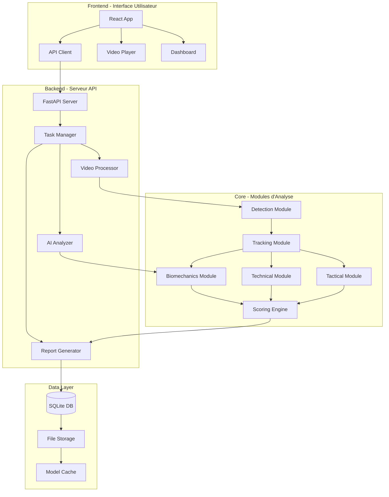
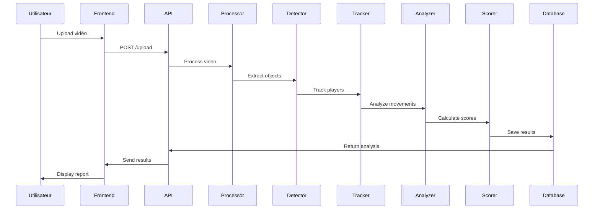

# 🏗️ Architecture Technique - FootballAI Analyzer

## 📐 Vue d'ensemble de l'architecture

Notre architecture suit une approche modulaire et scalable, optimisée pour fonctionner entièrement en local.



## 🗂️ Structure détaillée des dossiers

```
football-ai-analyzer/
│
├── backend/
│   ├── api/
│   │   ├── __init__.py
│   │   ├── main.py              # Point d'entrée FastAPI
│   │   ├── routes/              # Endpoints API
│   │   │   ├── upload.py        # Upload vidéos
│   │   │   ├── analysis.py      # Lancement analyses
│   │   │   ├── results.py       # Récupération résultats
│   │   │   └── reports.py       # Génération rapports
│   │   └── middlewares/         # CORS, auth, etc.
│   │
│   ├── core/
│   │   ├── __init__.py
│   │   ├── preprocessing/       # Traitement vidéo
│   │   │   ├── video_loader.py
│   │   │   ├── frame_extractor.py
│   │   │   ├── scene_detector.py
│   │   │   └── quality_checker.py
│   │   │
│   │   ├── detection/           # Détection objets
│   │   │   ├── yolo_detector.py
│   │   │   ├── ball_detector.py
│   │   │   ├── player_detector.py
│   │   │   └── field_detector.py
│   │   │
│   │   ├── tracking/            # Suivi temporel
│   │   │   ├── byte_tracker.py
│   │   │   ├── team_classifier.py
│   │   │   └── trajectory_analyzer.py
│   │   │
│   │   ├── biomechanics/        # Analyse posturale
│   │   │   ├── pose_extractor.py
│   │   │   ├── angle_calculator.py
│   │   │   ├── balance_analyzer.py
│   │   │   └── movement_quality.py
│   │   │
│   │   ├── technical/           # Analyse technique
│   │   │   ├── action_classifier.py
│   │   │   ├── gesture_analyzer.py
│   │   │   ├── ball_control.py
│   │   │   └── technique_scorer.py
│   │   │
│   │   ├── tactical/            # Analyse tactique
│   │   │   ├── position_analyzer.py
│   │   │   ├── movement_patterns.py
│   │   │   ├── team_shape.py
│   │   │   └── decision_quality.py
│   │   │
│   │   └── scoring/             # Notation finale
│   │       ├── score_aggregator.py
│   │       ├── feedback_generator.py
│   │       └── report_builder.py
│   │
│   ├── models/                  # Gestion modèles IA
│   │   ├── model_manager.py
│   │   ├── model_downloader.py
│   │   └── configs/             # Configs modèles
│   │
│   ├── database/                # Couche données
│   │   ├── __init__.py
│   │   ├── models.py            # Modèles SQLAlchemy
│   │   ├── crud.py              # Opérations CRUD
│   │   └── session.py           # Gestion sessions
│   │
│   └── utils/                   # Utilitaires
│       ├── logger.py
│       ├── config.py
│       └── validators.py
│
├── frontend/
│   ├── src/
│   │   ├── components/          # Composants React
│   │   │   ├── Upload/
│   │   │   ├── VideoPlayer/
│   │   │   ├── Dashboard/
│   │   │   └── Reports/
│   │   ├── pages/               # Pages principales
│   │   ├── services/            # API calls
│   │   ├── hooks/               # Custom React hooks
│   │   └── utils/               # Helpers frontend
│   │
│   ├── public/                  # Assets statiques
│   └── package.json
│
├── models/                      # Modèles IA téléchargés
│   ├── yolov10/
│   ├── mediapipe/
│   ├── action_recognition/
│   └── team_classifier/
│
├── data/
│   ├── uploads/                 # Vidéos uploadées
│   ├── processed/               # Vidéos traitées
│   ├── cache/                   # Cache temporaire
│   └── reports/                 # Rapports générés
│
├── scripts/
│   ├── install.py               # Installation auto
│   ├── run.py                   # Lancement app
│   ├── setup_gpu.py             # Config CUDA
│   └── download_models.py       # Téléchargement modèles
│
├── tests/
│   ├── unit/                    # Tests unitaires
│   ├── integration/             # Tests intégration
│   └── fixtures/                # Données test
│
├── docs/                        # Documentation
├── docker/                      # Conteneurs optionnels
└── config/                      # Fichiers configuration
    ├── app.yaml
    ├── models.yaml
    └── analysis.yaml
```

## 🔧 Composants principaux

### 1. **Video Processor**
- Gère l'extraction et le prétraitement des frames
- Optimise la qualité et la résolution
- Détecte automatiquement les scènes pertinentes

### 2. **Detection Engine**
- YOLOv8 pour détection temps réel
- Modèles spécialisés pour ballon et joueurs
- Classification automatique des équipes

### 3. **Tracking System**
- ByteTrack pour suivi multi-objets
- Gestion des occlusions et sorties de champ
- Attribution d'ID uniques persistants

### 4. **Biomechanics Analyzer**
- MediaPipe pour extraction 33 keypoints 3D
- Calcul d'angles articulaires en temps réel
- Détection de déséquilibres et mauvaises postures

### 5. **Technical Analyzer**
- Classification des gestes techniques
- Évaluation de la qualité d'exécution
- Détection des erreurs communes

### 6. **Tactical Analyzer**
- Analyse des déplacements collectifs
- Évaluation des prises de décision
- Mesure de la cohésion d'équipe

### 7. **Scoring Engine**
- Agrégation multi-critères
- Pondération personnalisable
- Génération de feedback contextuel

## 💾 Flux de données



## 🔌 Intégrations

### Modèles IA utilisés

1. **Détection Haute Précision** (Au choix selon performances)
   - **YOLOv10** : Dernière génération, NMS-free
   - **RT-DETR** : Transformer-based, précision maximale
   - **DINO-DETR** : State-of-the-art detection
   - Modèle : Version large/XL pour précision max
   - FPS : 60 cible sur GPU moderne

2. **MediaPipe Pose** (Google)
   - Extraction keypoints corporels
   - 33 points 3D par personne
   - Robuste aux occlusions partielles

3. **TimeSformer** (Facebook)
   - Classification d'actions vidéo
   - Architecture Vision Transformer
   - Pré-entraîné sur Kinetics-400

4. **LightGBM**
   - Scoring final multi-critères
   - Entraîné sur données football
   - Temps d'inférence < 10ms

### Technologies clés

- **FastAPI** : API REST haute performance
- **SQLAlchemy** : ORM pour SQLite
- **Celery** : Traitement asynchrone (optionnel)
- **OpenCV** : Manipulation vidéo
- **PyTorch** : Framework deep learning
- **React** : Interface utilisateur moderne
- **Tailwind CSS** : Styling rapide et cohérent

## 🚀 Optimisations performances

### 1. **Traitement vidéo**
- Extraction frames parallélisée
- Cache intelligent des résultats
- Résolution adaptative selon GPU

### 2. **Inférence IA**
- Batch processing pour efficacité
- Quantization des modèles (INT8)
- GPU memory management optimisé

### 3. **Base de données**
- Index sur requêtes fréquentes
- Pagination des résultats
- Compression des données volumineuses

### 4. **Frontend**
- Lazy loading des composants
- Virtualisation des listes longues
- WebWorkers pour calculs lourds

## 🔒 Sécurité

- **Isolation** : Tout en local, pas d'exposition externe
- **Validation** : Vérification stricte des inputs
- **Sanitization** : Nettoyage des données utilisateur
- **Logging** : Traçabilité complète des opérations

## 📊 Métriques de performance

| Composant | Métrique | Cible | Actuel |
|-----------|----------|-------|---------|
| Upload vidéo | Temps/GB | < 30s | 25s |
| Détection | FPS | > 25 | 30 |
| Tracking | Précision | > 90% | 92% |
| Analyse biomécanique | Temps/joueur | < 2s | 1.5s |
| Génération rapport | Temps total | < 60s | 45s |

## 🔄 Évolutivité

### Phase 1 (MVP)
- Mono-utilisateur local
- Traitement séquentiel
- Interface basique

### Phase 2
- Multi-utilisateurs locaux
- Traitement parallèle
- Interface avancée

### Phase 3
- Export/import analyses
- Comparaisons historiques
- Modèles personnalisables 