# 🎯 ARCHITECTURE DE DÉTECTION HYBRIDE - FOOTBALL AI

## 📊 Vue d'ensemble

Ce document détaille l'implémentation d'une architecture de détection hybride progressive utilisant YOLOv10, RT-DETR et DINO-DETR pour optimiser la détection en temps réel dans le football.

---

## 🏗️ Architecture Progressive

### Principe de Fonctionnement

```mermaid
graph TD
    A[Frame Vidéo] --> B[YOLOv10 - Détection Principale]
    B --> C{Analyse Complexité}
    C -->|Zones Denses| D[RT-DETR - Détection Secondaire]
    C -->|Standard| E[ByteTrack]
    D --> F{Précision Suffisante?}
    F -->|Non| G[DINO-DETR - Détection Tertiaire]
    F -->|Oui| E
    G --> E
    E --> H[Résultats Finaux]
```



---

## 💻 Implémentation Détaillée

### 1. Pipeline Principal

```python
import torch
import numpy as np
from ultralytics import YOLO, RTDETR
from typing import List, Dict, Optional, Tuple
import cv2

class HybridFootballDetector:
    """
    Architecture de détection hybride pour l'analyse football.
    Combine YOLOv10, RT-DETR et DINO-DETR de manière progressive.
    """
    
    def __init__(self, config: Dict):
        self.config = config
        
        # 1. Détecteur principal - YOLOv10
        self.yolo = YOLO('yolov10x.pt')
        self.yolo.overrides.update({
            'conf': 0.5,
            'iou': 0.5,
            'imgsz': 1280,
            'device': 'cuda:0'
        })
        
        # 2. Détecteur secondaire - RT-DETR (chargé à la demande)
        self.rtdetr = None
        self.rtdetr_config = {
            'model': 'rtdetr-l.pt',
            'conf': 0.4,
            'iou': 0.5,
            'imgsz': 1280
        }
        
        # 3. Détecteur tertiaire - DINO-DETR (chargé si nécessaire)
        self.dino_detr = None
        self.dino_config = {
            'model': 'IDEA-Research/dino-detr-r50',
            'threshold': 0.35
        }
        
        # Métriques pour décision
        self.density_threshold = 5  # Joueurs par zone
        self.occlusion_threshold = 0.3
        self.precision_threshold = 0.85
        
    def detect(self, frame: np.ndarray) -> Dict:
        """
        Détection progressive avec switching intelligent.
        """
        results = {
            'detections': [],
            'method_used': [],
            'processing_time': {}
        }
        
        # Phase 1: YOLOv10 toujours actif
        start_time = time.time()
        yolo_results = self._detect_yolo(frame)
        results['processing_time']['yolo'] = time.time() - start_time
        results['detections'] = yolo_results
        results['method_used'].append('YOLOv10')
        
        # Analyse de la complexité de la scène
        scene_complexity = self._analyze_scene_complexity(yolo_results, frame)
        
        # Phase 2: RT-DETR si zones denses
        if scene_complexity['has_dense_areas']:
            start_time = time.time()
            rtdetr_results = self._detect_rtdetr(
                frame, 
                scene_complexity['dense_regions']
            )
            results['processing_time']['rtdetr'] = time.time() - start_time
            results['detections'] = self._merge_detections(
                results['detections'], 
                rtdetr_results
            )
            results['method_used'].append('RT-DETR')
        
        # Phase 3: DINO-DETR si précision insuffisante
        if self._needs_high_precision(results['detections'], scene_complexity):
            start_time = time.time()
            dino_results = self._detect_dino(frame)
            results['processing_time']['dino'] = time.time() - start_time
            results['detections'] = self._refine_with_dino(
                results['detections'], 
                dino_results
            )
            results['method_used'].append('DINO-DETR')
        
        return results
```

### 2. Détection YOLOv10

```python
def _detect_yolo(self, frame: np.ndarray) -> List[Dict]:
    """Détection principale avec YOLOv10."""
    results = self.yolo(frame, verbose=False)
    
    detections = []
    for r in results:
        boxes = r.boxes
        if boxes is not None:
            for i in range(len(boxes)):
                detection = {
                    'bbox': boxes.xyxy[i].cpu().numpy(),
                    'confidence': float(boxes.conf[i]),
                    'class_id': int(boxes.cls[i]),
                    'class_name': self.yolo.names[int(boxes.cls[i])],
                    'detector': 'YOLOv10'
                }
                detections.append(detection)
    
    return detections

def _analyze_scene_complexity(self, detections: List[Dict], frame: np.ndarray) -> Dict:
    """Analyse la complexité de la scène pour décider si RT-DETR est nécessaire."""
    h, w = frame.shape[:2]
    grid_size = 100  # Grille pour analyser la densité
    
    # Créer une grille de densité
    density_grid = np.zeros((h // grid_size + 1, w // grid_size + 1))
    dense_regions = []
    
    for det in detections:
        if det['class_name'] in ['player', 'goalkeeper', 'referee']:
            bbox = det['bbox']
            cx = int((bbox[0] + bbox[2]) / 2)
            cy = int((bbox[1] + bbox[3]) / 2)
            grid_x = cx // grid_size
            grid_y = cy // grid_size
            density_grid[grid_y, grid_x] += 1
    
    # Identifier les zones denses
    for y in range(density_grid.shape[0]):
        for x in range(density_grid.shape[1]):
            if density_grid[y, x] >= self.density_threshold:
                dense_regions.append({
                    'x1': x * grid_size,
                    'y1': y * grid_size,
                    'x2': min((x + 1) * grid_size, w),
                    'y2': min((y + 1) * grid_size, h),
                    'density': density_grid[y, x]
                })
    
    # Calculer l'occlusion
    occlusion_score = self._calculate_occlusion_score(detections)
    
    return {
        'has_dense_areas': len(dense_regions) > 0,
        'dense_regions': dense_regions,
        'total_objects': len(detections),
        'occlusion_score': occlusion_score,
        'max_density': np.max(density_grid)
    }
```

### 3. Détection RT-DETR pour Zones Denses

```python
def _detect_rtdetr(self, frame: np.ndarray, regions: List[Dict]) -> List[Dict]:
    """Détection RT-DETR sur les zones denses identifiées."""
    # Charger RT-DETR si nécessaire
    if self.rtdetr is None:
        self._load_rtdetr()
    
    detections = []
    
    for region in regions:
        # Extraire la région avec padding
        padding = 50
        x1 = max(0, region['x1'] - padding)
        y1 = max(0, region['y1'] - padding)
        x2 = min(frame.shape[1], region['x2'] + padding)
        y2 = min(frame.shape[0], region['y2'] + padding)
        
        roi = frame[y1:y2, x1:x2]
        
        # Détection RT-DETR sur la région
        results = self.rtdetr(roi, verbose=False)
        
        # Ajuster les coordonnées
        for r in results:
            boxes = r.boxes
            if boxes is not None:
                for i in range(len(boxes)):
                    # Convertir coordonnées ROI vers frame complet
                    bbox = boxes.xyxy[i].cpu().numpy()
                    bbox[0] += x1
                    bbox[1] += y1
                    bbox[2] += x1
                    bbox[3] += y1
                    
                    detection = {
                        'bbox': bbox,
                        'confidence': float(boxes.conf[i]),
                        'class_id': int(boxes.cls[i]),
                        'class_name': self.rtdetr.names[int(boxes.cls[i])],
                        'detector': 'RT-DETR',
                        'region_density': region['density']
                    }
                    detections.append(detection)
    
    return detections

def _load_rtdetr(self):
    """Charge RT-DETR à la demande."""
    print("Chargement de RT-DETR...")
    self.rtdetr = RTDETR(self.rtdetr_config['model'])
    self.rtdetr.overrides.update({
        'conf': self.rtdetr_config['conf'],
        'iou': self.rtdetr_config['iou'],
        'imgsz': self.rtdetr_config['imgsz'],
        'device': 'cuda:0'
    })
```

### 4. Détection DINO-DETR pour Précision Maximale

```python
def _needs_high_precision(self, detections: List[Dict], complexity: Dict) -> bool:
    """Détermine si DINO-DETR est nécessaire."""
    # Critères pour activer DINO-DETR
    avg_confidence = np.mean([d['confidence'] for d in detections]) if detections else 0
    
    return (
        avg_confidence < self.precision_threshold or
        complexity['occlusion_score'] > self.occlusion_threshold or
        complexity['max_density'] > 8 or
        self._has_missed_detections(detections, complexity)
    )

def _detect_dino(self, frame: np.ndarray) -> List[Dict]:
    """Détection DINO-DETR pour précision maximale."""
    # Charger DINO-DETR si nécessaire
    if self.dino_detr is None:
        self._load_dino_detr()
    
    # Préparation de l'image
    from transformers import AutoImageProcessor
    processor = AutoImageProcessor.from_pretrained(self.dino_config['model'])
    inputs = processor(images=frame, return_tensors="pt").to('cuda')
    
    # Inférence
    with torch.no_grad():
        outputs = self.dino_detr(**inputs)
    
    # Post-processing
    target_sizes = torch.tensor([frame.shape[:2]]).cuda()
    results = processor.post_process_object_detection(
        outputs, 
        target_sizes=target_sizes, 
        threshold=self.dino_config['threshold']
    )[0]
    
    detections = []
    for score, label, box in zip(results["scores"], results["labels"], results["boxes"]):
        detection = {
            'bbox': box.cpu().numpy(),
            'confidence': float(score),
            'class_id': int(label),
            'class_name': self._map_dino_class(int(label)),
            'detector': 'DINO-DETR'
        }
        detections.append(detection)
    
    return detections

def _load_dino_detr(self):
    """Charge DINO-DETR à la demande."""
    print("Chargement de DINO-DETR (peut prendre un moment)...")
    from transformers import AutoModelForObjectDetection
    self.dino_detr = AutoModelForObjectDetection.from_pretrained(
        self.dino_config['model']
    ).to('cuda')
    self.dino_detr.eval()
```

### 5. Fusion et Post-Processing

```python
def _merge_detections(self, primary: List[Dict], secondary: List[Dict]) -> List[Dict]:
    """Fusionne intelligemment les détections de plusieurs sources."""
    merged = primary.copy()
    
    for sec_det in secondary:
        # Vérifier si cette détection existe déjà
        is_duplicate = False
        
        for i, prim_det in enumerate(merged):
            iou = self._calculate_iou(prim_det['bbox'], sec_det['bbox'])
            
            if iou > 0.5 and sec_det['class_id'] == prim_det['class_id']:
                # Mise à jour si meilleure confiance
                if sec_det['confidence'] > prim_det['confidence']:
                    merged[i] = sec_det
                is_duplicate = True
                break
        
        if not is_duplicate:
            merged.append(sec_det)
    
    return merged

def _calculate_iou(self, box1: np.ndarray, box2: np.ndarray) -> float:
    """Calcule l'IoU entre deux bounding boxes."""
    x1 = max(box1[0], box2[0])
    y1 = max(box1[1], box2[1])
    x2 = min(box1[2], box2[2])
    y2 = min(box1[3], box2[3])
    
    intersection = max(0, x2 - x1) * max(0, y2 - y1)
    area1 = (box1[2] - box1[0]) * (box1[3] - box1[1])
    area2 = (box2[2] - box2[0]) * (box2[3] - box2[1])
    union = area1 + area2 - intersection
    
    return intersection / union if union > 0 else 0
```

---

## 📊 Métriques et Monitoring

### Système de Métriques

```python
class DetectionMetrics:
    """Collecte et analyse les métriques de détection."""
    
    def __init__(self):
        self.metrics = {
            'yolo_usage': 0,
            'rtdetr_usage': 0,
            'dino_usage': 0,
            'avg_fps': 0,
            'avg_detections': 0,
            'occlusion_events': 0
        }
        
    def update(self, results: Dict):
        """Met à jour les métriques avec les derniers résultats."""
        # Compteurs d'utilisation
        for method in results['method_used']:
            if 'YOLO' in method:
                self.metrics['yolo_usage'] += 1
            elif 'RT-DETR' in method:
                self.metrics['rtdetr_usage'] += 1
            elif 'DINO' in method:
                self.metrics['dino_usage'] += 1
        
        # Calcul FPS
        total_time = sum(results['processing_time'].values())
        fps = 1.0 / total_time if total_time > 0 else 0
        self.metrics['avg_fps'] = (
            self.metrics['avg_fps'] * 0.9 + fps * 0.1
        )  # Moving average
        
    def get_report(self) -> Dict:
        """Génère un rapport des métriques."""
        total = sum([
            self.metrics['yolo_usage'],
            self.metrics['rtdetr_usage'],
            self.metrics['dino_usage']
        ])
        
        if total == 0:
            return self.metrics
        
        return {
            **self.metrics,
            'yolo_percentage': self.metrics['yolo_usage'] / total * 100,
            'rtdetr_percentage': self.metrics['rtdetr_usage'] / total * 100,
            'dino_percentage': self.metrics['dino_usage'] / total * 100
        }
```

---

## 🚀 Optimisations

### 1. Optimisation GPU

```python
# Utilisation de TensorRT pour YOLOv10 et RT-DETR
def optimize_models():
    # Export YOLOv10 vers TensorRT
    yolo = YOLO('yolov10x.pt')
    yolo.export(format='engine', imgsz=1280, half=True)
    
    # Export RT-DETR vers TensorRT
    rtdetr = RTDETR('rtdetr-l.pt')
    rtdetr.export(format='engine', imgsz=1280, half=True)
```

### 2. Batching Intelligent

```python
class BatchProcessor:
    """Traitement par batch pour améliorer le throughput."""
    
    def __init__(self, detector: HybridFootballDetector, batch_size: int = 4):
        self.detector = detector
        self.batch_size = batch_size
        self.frame_buffer = []
        
    def add_frame(self, frame: np.ndarray) -> Optional[List[Dict]]:
        """Ajoute un frame au buffer et traite si batch complet."""
        self.frame_buffer.append(frame)
        
        if len(self.frame_buffer) >= self.batch_size:
            results = self._process_batch()
            self.frame_buffer = []
            return results
        
        return None
```

---

## 📈 Benchmarks Attendus

| Scénario | FPS | mAP | Détecteurs Utilisés |
|----------|-----|-----|---------------------|
| Match standard | 85 | 94.2% | YOLOv10 (100%) |
| Actions de but | 75 | 95.1% | YOLOv10 (70%) + RT-DETR (30%) |
| Mêlées/Corners | 65 | 96.3% | YOLOv10 (50%) + RT-DETR (40%) + DINO (10%) |
| Analyse replay | 42 | 97.2% | YOLOv10 (30%) + RT-DETR (40%) + DINO (30%) |

---

## 💡 Recommandations d'Usage

1. **Production Standard** : YOLOv10 seul (85+ FPS)
2. **Matchs Importants** : Hybride YOLOv10 + RT-DETR
3. **Analyse Détaillée** : Pipeline complet avec DINO-DETR
4. **Entraînement** : Commencer par YOLOv10, ajouter progressivement

Cette architecture garantit le meilleur compromis entre performance temps réel et précision maximale selon les besoins. 