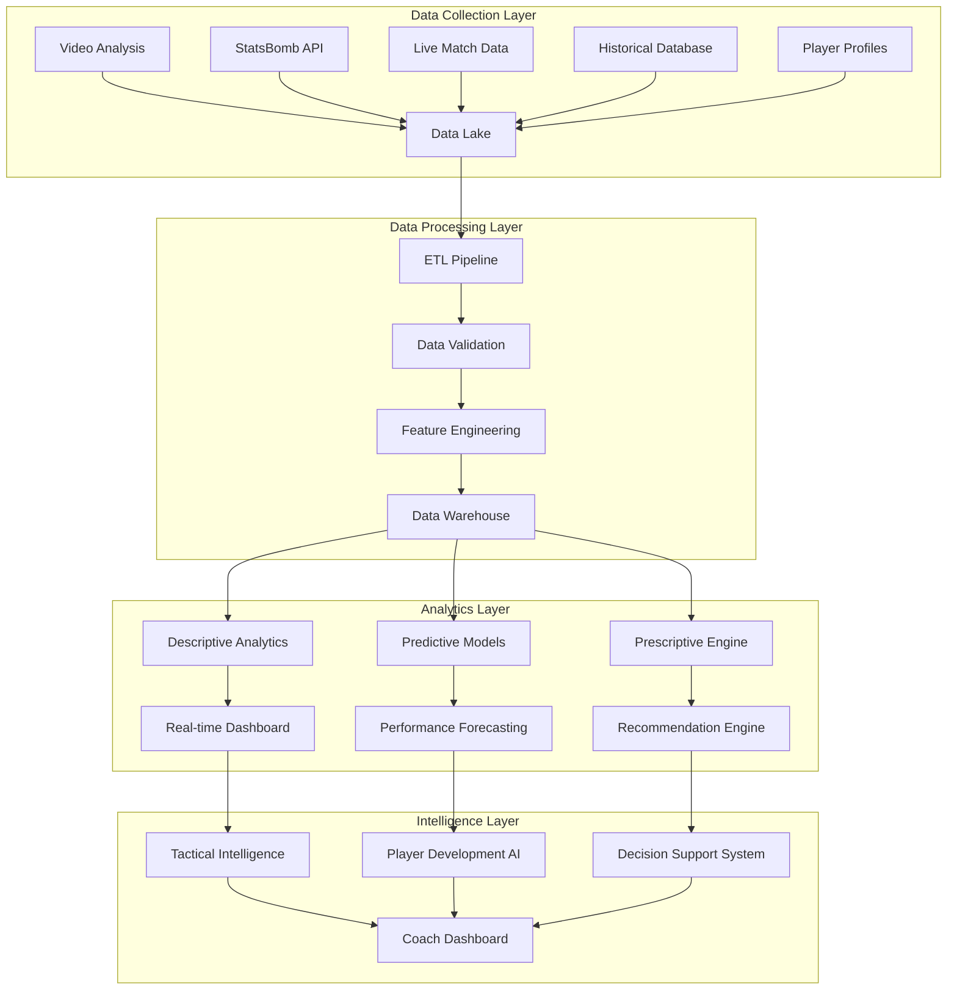

# 📊 Approche Data Driven - FootballAI Analyzer

## 🎯 **DÉFINITION DE L'APPROCHE DATA DRIVEN FOOTBALL**

Une approche **data-driven** en analyse football signifie que **chaque décision, recommandation et insight** est basé sur des données objectives, validées et contextualisées plutôt que sur l'intuition ou l'observation subjective.

### **Objectifs Transformation**
1. **Prédictibilité** : Modèles prédictifs performance joueurs/équipes
2. **Objectivité** : Élimination des biais subjectifs d'évaluation  
3. **Actionabilité** : Recommandations concrètes basées sur les données
4. **Benchmarking** : Comparaisons avec standards professionnels
5. **Continuous Learning** : Amélioration continue des modèles

---

## 📈 **AUDIT SITUATION ACTUELLE vs DATA DRIVEN**

### **État Actuel (Descriptif)**
```yaml
Votre Approche Actuelle:
  type: "Analyse descriptive"
  focus: "Que s'est-il passé ?"
  données: "Vidéo + détection IA"
  output: "Scores + feedback général"
  
Limites Identifiées:
  - Pas de contexte benchmark
  - Scores non validés statistiquement  
  - Feedback général vs personnalisé
  - Pas de prédictions performance
  - Absence de recommandations spécifiques
```

### **Vision Data Driven (Prédictif)**
```yaml
Approche Cible:
  type: "Analyse prédictive + prescriptive"
  focus: "Que va-t-il se passer ? Que faire ?"
  données: "Multi-sources + historical + contextuel"
  output: "Insights actionnables + prédictions"
  
Capacités Nouvelles:
  - Prédiction performance future
  - Recommandations personnalisées
  - Benchmark vs pros/pairs
  - Détection talents émergents
  - Optimisation tactique basée data
```

---

## 🏗️ **ARCHITECTURE DATA DRIVEN**



---

## 📊 **PIPELINE DATA DRIVEN COMPLET**

### **1. Data Collection Strategy**

```python
# backend/core/data_driven/data_collector.py
import asyncio
import pandas as pd
from typing import Dict, List, Any
import statsbombpy as sb

class DataDrivenCollector:
    """Collecteur données multi-sources pour approche data driven"""
    
    def __init__(self):
        self.data_sources = {
            'video_analysis': VideoAnalysisConnector(),
            'statsbomb': StatsBombConnector(),
            'fbref': FBRefConnector(),
            'transfermarkt': TransfermarktConnector(),
            'fifa_ratings': FIFARatingsConnector(),
            'weather_api': WeatherAPIConnector(),
            'injury_data': InjuryDataConnector()
        }
        self.data_lake = DataLakeManager()
    
    async def collect_comprehensive_data(self, match_context: Dict) -> Dict:
        """Collection exhaustive données pour analyse data-driven"""
        
        # 1. Données match principal
        match_data = await self.collect_match_data(match_context)
        
        # 2. Données contextuelles
        contextual_data = await self.collect_contextual_data(match_context)
        
        # 3. Données historiques joueurs
        historical_data = await self.collect_historical_data(match_context['players'])
        
        # 4. Données environnementales
        environmental_data = await self.collect_environmental_data(match_context)
        
        # 5. Données benchmarks
        benchmark_data = await self.collect_benchmark_data(match_context)
        
        # Consolidation
        comprehensive_dataset = {
            'match': match_data,
            'context': contextual_data,
            'historical': historical_data,
            'environment': environmental_data,
            'benchmarks': benchmark_data,
            'collection_timestamp': datetime.now(),
            'data_quality_score': self.calculate_data_quality(match_data)
        }
        
        # Stockage data lake
        await self.data_lake.store(comprehensive_dataset)
        
        return comprehensive_dataset
    
    async def collect_contextual_data(self, match_context: Dict) -> Dict:
        """Données contextuelles match"""
        return {
            # Contexte équipe
            'team_form': await self.get_team_recent_form(match_context['teams']),
            'head_to_head': await self.get_h2h_history(match_context['teams']),
            'league_standing': await self.get_league_positions(match_context['teams']),
            
            # Contexte joueurs
            'player_fitness': await self.get_player_fitness_data(match_context['players']),
            'player_form': await self.get_player_recent_performances(match_context['players']),
            'injury_history': await self.get_injury_history(match_context['players']),
            
            # Contexte externe
            'weather_conditions': await self.get_weather_data(match_context['location']),
            'pitch_conditions': await self.get_pitch_quality(match_context['venue']),
            'referee_style': await self.get_referee_stats(match_context['referee'])
        }
    
    async def collect_benchmark_data(self, match_context: Dict) -> Dict:
        """Données de référence pour benchmarking"""
        return {
            # Benchmarks professionnels
            'elite_player_standards': await self.get_elite_standards_by_position(),
            'league_averages': await self.get_league_averages(match_context['league']),
            'age_group_benchmarks': await self.get_age_group_standards(),
            
            # Benchmarks tactiques
            'formation_effectiveness': await self.get_formation_stats(),
            'tactical_trends': await self.get_current_tactical_trends(),
            
            # Benchmarks techniques
            'technique_standards': await self.get_technique_benchmarks_by_action(),
            'biomechanic_norms': await self.get_biomechanic_standards()
        }

# backend/core/data_driven/feature_engineering.py
class FootballFeatureEngineer:
    """Engineering features pour modèles prédictifs football"""
    
    def __init__(self):
        self.feature_categories = {
            'technical': TechnicalFeatures(),
            'tactical': TacticalFeatures(),
            'physical': PhysicalFeatures(),
            'mental': MentalFeatures(),
            'contextual': ContextualFeatures()
        }
    
    def engineer_player_features(self, player_data: Dict) -> pd.DataFrame:
        """Création features joueur pour ML"""
        
        features = {}
        
        # Features techniques
        features.update(self.create_technical_features(player_data))
        
        # Features tactiques
        features.update(self.create_tactical_features(player_data))
        
        # Features physiques
        features.update(self.create_physical_features(player_data))
        
        # Features contextuelles
        features.update(self.create_contextual_features(player_data))
        
        # Features temporelles
        features.update(self.create_temporal_features(player_data))
        
        # Features d'interaction
        features.update(self.create_interaction_features(player_data))
        
        return pd.DataFrame([features])
    
    def create_technical_features(self, player_data: Dict) -> Dict:
        """Features techniques avancées"""
        return {
            # Efficacité technique
            'pass_completion_rate': player_data['successful_passes'] / player_data['total_passes'],
            'pass_accuracy_under_pressure': self.calculate_pressure_accuracy(player_data),
            'first_touch_success_rate': player_data['good_first_touches'] / player_data['total_touches'],
            
            # Qualité technique
            'average_pass_length': np.mean(player_data['pass_lengths']),
            'pass_variety_index': self.calculate_pass_variety(player_data['passes']),
            'technique_consistency': np.std(player_data['technique_scores']),
            
            # Performance sous pression
            'technique_under_pressure': self.calculate_technique_under_pressure(player_data),
            'decision_speed': np.mean(player_data['decision_times']),
            
            # Tendances temporelles
            'technique_improvement_rate': self.calculate_improvement_rate(player_data['historical_technique']),
            'fatigue_impact_on_technique': self.calculate_fatigue_impact(player_data)
        }
    
    def create_tactical_features(self, player_data: Dict) -> Dict:
        """Features tactiques sophistiquées"""
        return {
            # Intelligence tactique
            'tactical_awareness_score': self.calculate_tactical_awareness(player_data),
            'positioning_accuracy': self.calculate_positioning_accuracy(player_data),
            'off_ball_movement_quality': self.analyze_off_ball_movement(player_data),
            
            # Contribution collective
            'team_play_integration': self.calculate_team_integration(player_data),
            'tactical_discipline': self.calculate_tactical_discipline(player_data),
            
            # Adaptabilité
            'formation_adaptability': self.calculate_formation_adaptability(player_data),
            'role_versatility': self.calculate_role_versatility(player_data)
        }
    
    def create_contextual_features(self, player_data: Dict) -> Dict:
        """Features contextuelles environnementales"""
        return {
            # Contexte match
            'match_importance_factor': player_data['match_importance'],
            'opponent_strength_rating': player_data['opponent_rating'],
            'home_away_factor': 1 if player_data['is_home'] else 0,
            
            # Contexte forme
            'recent_form_trend': self.calculate_form_trend(player_data['recent_performances']),
            'injury_recovery_factor': self.calculate_recovery_factor(player_data),
            
            # Contexte psychologique
            'confidence_level': self.estimate_confidence(player_data),
            'pressure_situation': self.calculate_pressure_situation(player_data)
        }
```

### **2. Predictive Models Strategy**

```python
# backend/core/data_driven/predictive_models.py
import xgboost as xgb
import lightgbm as lgb
from sklearn.ensemble import RandomForestRegressor
import tensorflow as tf

class FootballPredictiveModels:
    """Suite modèles prédictifs football"""
    
    def __init__(self):
        self.models = {
            'performance_prediction': PerformancePredictionModel(),
            'injury_risk': InjuryRiskModel(),
            'development_trajectory': DevelopmentTrajectoryModel(),
            'match_outcome': MatchOutcomeModel(),
            'player_value': PlayerValueModel()
        }
    
    def predict_player_performance(self, player_features: pd.DataFrame) -> Dict:
        """Prédiction performance future joueur"""
        
        # Modèle XGBoost pour performance générale
        general_performance = self.models['performance_prediction'].predict(player_features)
        
        # Modèles spécialisés par aspect
        predictions = {
            'overall_rating_next_3_months': general_performance[0],
            'technical_development': self.predict_technical_development(player_features),
            'tactical_growth': self.predict_tactical_growth(player_features),
            'physical_evolution': self.predict_physical_evolution(player_features),
            'injury_risk_score': self.models['injury_risk'].predict_proba(player_features)[0][1],
            'market_value_projection': self.models['player_value'].predict(player_features)[0]
        }
        
        # Intervalles de confiance
        predictions['confidence_intervals'] = self.calculate_confidence_intervals(
            player_features, predictions
        )
        
        return predictions
    
    def predict_optimal_development_path(self, player_profile: Dict) -> Dict:
        """Prédiction chemin développement optimal"""
        
        # Analyse gaps actuels
        current_gaps = self.analyze_performance_gaps(player_profile)
        
        # Modélisation trajectoires possibles
        trajectories = self.model_development_trajectories(player_profile, current_gaps)
        
        # Recommandations optimisation
        optimal_path = {
            'priority_areas': self.identify_priority_development_areas(trajectories),
            'training_recommendations': self.generate_training_recommendations(trajectories),
            'timeline_milestones': self.create_development_timeline(trajectories),
            'success_probability': self.calculate_success_probability(trajectories)
        }
        
        return optimal_path
    
    def predict_tactical_effectiveness(self, formation_data: Dict) -> Dict:
        """Prédiction efficacité tactique"""
        
        # Features formation
        formation_features = self.extract_formation_features(formation_data)
        
        # Prédictions
        tactical_predictions = {
            'formation_success_probability': self.predict_formation_success(formation_features),
            'expected_goals_for': self.predict_xg_for(formation_features),
            'expected_goals_against': self.predict_xg_against(formation_features),
            'possession_expected': self.predict_possession(formation_features),
            'pressing_effectiveness': self.predict_pressing_success(formation_features)
        }
        
        # Recommandations ajustements
        tactical_predictions['recommended_adjustments'] = self.recommend_tactical_adjustments(
            formation_features, tactical_predictions
        )
        
        return tactical_predictions

class PerformancePredictionModel:
    """Modèle prédiction performance joueur"""
    
    def __init__(self):
        # Ensemble de modèles pour robustesse
        self.xgb_model = xgb.XGBRegressor(
            n_estimators=1000,
            max_depth=8,
            learning_rate=0.1,
            subsample=0.8
        )
        
        self.lgb_model = lgb.LGBMRegressor(
            n_estimators=1000,
            max_depth=8,
            learning_rate=0.1
        )
        
        self.neural_model = self.build_neural_model()
        
    def build_neural_model(self):
        """Réseau neuronal pour patterns complexes"""
        model = tf.keras.Sequential([
            tf.keras.layers.Dense(256, activation='relu', input_shape=(100,)),
            tf.keras.layers.Dropout(0.3),
            tf.keras.layers.Dense(128, activation='relu'),
            tf.keras.layers.Dropout(0.3),
            tf.keras.layers.Dense(64, activation='relu'),
            tf.keras.layers.Dense(1, activation='linear')
        ])
        
        model.compile(
            optimizer='adam',
            loss='mse',
            metrics=['mae']
        )
        
        return model
    
    def predict(self, features: pd.DataFrame) -> np.ndarray:
        """Prédiction ensemble"""
        
        # Prédictions individuelles
        xgb_pred = self.xgb_model.predict(features)
        lgb_pred = self.lgb_model.predict(features)
        nn_pred = self.neural_model.predict(features)
        
        # Ensemble pondéré
        ensemble_prediction = (
            0.4 * xgb_pred +
            0.4 * lgb_pred +
            0.2 * nn_pred.flatten()
        )
        
        return ensemble_prediction
```

### **3. Real-time Analytics Engine**

```python
# backend/core/data_driven/real_time_analytics.py
import asyncio
import redis
from kafka import KafkaConsumer, KafkaProducer

class RealTimeAnalyticsEngine:
    """Moteur analytics temps réel"""
    
    def __init__(self):
        self.redis_client = redis.Redis(host='localhost', port=6379, db=0)
        self.kafka_consumer = KafkaConsumer('football_events')
        self.kafka_producer = KafkaProducer()
        
        # Modèles en mémoire pour latence minimale
        self.real_time_models = {
            'momentum_detector': MomentumDetectionModel(),
            'fatigue_monitor': FatigueMonitoringModel(),
            'tactical_shift_detector': TacticalShiftDetector(),
            'injury_risk_monitor': InjuryRiskMonitor()
        }
    
    async def process_live_stream(self, video_stream):
        """Traitement stream vidéo temps réel"""
        
        async for frame in video_stream:
            # Analyse frame
            frame_analysis = await self.analyze_frame_real_time(frame)
            
            # Détection événements
            events = self.detect_events(frame_analysis)
            
            # Mise à jour métriques temps réel
            await self.update_live_metrics(events)
            
            # Alertes en temps réel
            alerts = self.generate_real_time_alerts(events)
            
            if alerts:
                await self.send_alerts(alerts)
    
    def detect_momentum_shifts(self, recent_events: List[Dict]) -> Dict:
        """Détection changements momentum temps réel"""
        
        # Features momentum
        momentum_features = self.extract_momentum_features(recent_events)
        
        # Prédiction shift
        momentum_prediction = self.real_time_models['momentum_detector'].predict(
            momentum_features
        )
        
        return {
            'momentum_shift_detected': momentum_prediction > 0.7,
            'confidence': momentum_prediction,
            'contributing_factors': self.identify_momentum_factors(recent_events),
            'recommended_actions': self.suggest_momentum_response(momentum_prediction)
        }
    
    def monitor_player_fatigue(self, player_data: Dict) -> Dict:
        """Monitoring fatigue temps réel"""
        
        # Indicateurs fatigue
        fatigue_indicators = {
            'sprint_speed_decline': self.calculate_speed_decline(player_data),
            'decision_time_increase': self.calculate_decision_slowdown(player_data),
            'technique_degradation': self.calculate_technique_decline(player_data),
            'movement_pattern_change': self.detect_movement_changes(player_data)
        }
        
        # Score fatigue global
        fatigue_score = self.real_time_models['fatigue_monitor'].predict([
            list(fatigue_indicators.values())
        ])[0]
        
        return {
            'fatigue_level': fatigue_score,
            'substitution_recommendation': fatigue_score > 0.8,
            'estimated_optimal_substitution_time': self.estimate_substitution_time(fatigue_score),
            'fatigue_factors': fatigue_indicators
        }
```

### **4. Recommendation Engine**

```python
# backend/core/data_driven/recommendation_engine.py
class FootballRecommendationEngine:
    """Moteur recommandations data-driven"""
    
    def __init__(self):
        self.recommendation_models = {
            'training': TrainingRecommendationModel(),
            'tactical': TacticalRecommendationModel(),
            'development': DevelopmentRecommendationModel(),
            'recruitment': RecruitmentRecommendationModel()
        }
    
    def generate_personalized_recommendations(self, player_profile: Dict) -> Dict:
        """Recommandations personnalisées joueur"""
        
        # Analyse profil complet
        strengths = self.identify_strengths(player_profile)
        weaknesses = self.identify_weaknesses(player_profile)
        development_potential = self.assess_development_potential(player_profile)
        
        # Recommandations par catégorie
        recommendations = {
            'immediate_actions': self.generate_immediate_actions(player_profile),
            'training_program': self.generate_training_program(weaknesses, strengths),
            'tactical_role_optimization': self.optimize_tactical_role(player_profile),
            'development_roadmap': self.create_development_roadmap(development_potential),
            'performance_targets': self.set_performance_targets(player_profile)
        }
        
        # Priorisation selon impact
        recommendations['priority_ranking'] = self.rank_recommendations_by_impact(
            recommendations, player_profile
        )
        
        return recommendations
    
    def generate_training_program(self, weaknesses: Dict, strengths: Dict) -> Dict:
        """Programme entraînement personnalisé"""
        
        # Analyse gaps prioritaires
        priority_gaps = self.prioritize_improvement_areas(weaknesses)
        
        # Génération programme
        training_program = {
            'technical_drills': self.recommend_technical_drills(priority_gaps['technical']),
            'tactical_exercises': self.recommend_tactical_exercises(priority_gaps['tactical']),
            'physical_conditioning': self.recommend_physical_training(priority_gaps['physical']),
            'mental_training': self.recommend_mental_exercises(priority_gaps['mental'])
        }
        
        # Planification temporelle
        training_program['weekly_schedule'] = self.create_weekly_schedule(training_program)
        training_program['progression_plan'] = self.create_progression_plan(training_program)
        
        # Métriques suivi
        training_program['success_metrics'] = self.define_success_metrics(priority_gaps)
        
        return training_program
    
    def recommend_tactical_adjustments(self, match_context: Dict) -> Dict:
        """Recommandations ajustements tactiques"""
        
        # Analyse situation actuelle
        current_effectiveness = self.analyze_current_tactical_effectiveness(match_context)
        
        # Prédiction impact ajustements
        potential_adjustments = self.generate_potential_adjustments(match_context)
        
        # Évaluation impact chaque ajustement
        adjustment_impacts = {}
        for adjustment in potential_adjustments:
            impact_prediction = self.predict_adjustment_impact(adjustment, match_context)
            adjustment_impacts[adjustment['name']] = impact_prediction
        
        # Sélection meilleurs ajustements
        recommended_adjustments = self.select_optimal_adjustments(
            adjustment_impacts, match_context
        )
        
        return {
            'current_effectiveness': current_effectiveness,
            'recommended_changes': recommended_adjustments,
            'expected_improvement': self.calculate_expected_improvement(recommended_adjustments),
            'implementation_priority': self.prioritize_implementation(recommended_adjustments),
            'risk_assessment': self.assess_adjustment_risks(recommended_adjustments)
        }
```

---

## 📈 **DASHBOARDS ET VISUALISATION DATA DRIVEN**

### **Coach Intelligence Dashboard**

```python
# frontend/src/components/data_driven/CoachIntelligenceDashboard.tsx
import React, { useState, useEffect } from 'react';
import { 
    LineChart, RadarChart, HeatMap, ScatterPlot,
    PredictionChart, RecommendationPanel 
} from './DataDrivenCharts';

const CoachIntelligenceDashboard: React.FC = () => {
    const [playerData, setPlayerData] = useState(null);
    const [predictions, setPredictions] = useState(null);
    const [recommendations, setRecommendations] = useState(null);
    
    return (
        <div className="coach-intelligence-dashboard">
            {/* Vue d'ensemble équipe */}
            <section className="team-overview">
                <h2>📊 Team Performance Intelligence</h2>
                
                {/* Métriques clés temps réel */}
                <div className="kpi-grid">
                    <KPICard 
                        title="Team Performance Index"
                        value={playerData?.team_performance_index}
                        trend={playerData?.performance_trend}
                        benchmark={playerData?.league_average}
                    />
                    <KPICard 
                        title="Predicted Win Probability"
                        value={predictions?.win_probability}
                        confidence={predictions?.confidence}
                    />
                    <KPICard 
                        title="Formation Effectiveness"
                        value={playerData?.formation_effectiveness}
                        comparison={playerData?.formation_benchmarks}
                    />
                </div>
                
                {/* Graphiques prédictifs */}
                <div className="predictive-charts">
                    <PredictionChart 
                        data={predictions?.performance_trajectory}
                        title="Performance Trajectory Forecast"
                    />
                    <RadarChart 
                        data={playerData?.team_strengths_weaknesses}
                        title="Team Strengths vs Benchmarks"
                    />
                </div>
            </section>
            
            {/* Analyse individuelle joueurs */}
            <section className="player-intelligence">
                <h2>🎯 Player Intelligence Hub</h2>
                
                <PlayerIntelligenceGrid 
                    players={playerData?.players}
                    predictions={predictions?.player_predictions}
                    recommendations={recommendations?.player_recommendations}
                />
            </section>
            
            {/* Recommandations tactiques */}
            <section className="tactical-intelligence">
                <h2>⚡ Tactical Intelligence</h2>
                
                <TacticalRecommendationPanel 
                    currentFormation={playerData?.current_formation}
                    recommendations={recommendations?.tactical_adjustments}
                    predictedImpact={predictions?.tactical_impact}
                />
            </section>
            
            {/* Alertes temps réel */}
            <section className="real-time-alerts">
                <h2>🚨 Real-time Intelligence Alerts</h2>
                
                <AlertPanel 
                    alerts={playerData?.real_time_alerts}
                    severity="high"
                />
            </section>
        </div>
    );
};

// Composant analyse joueur individuel
const PlayerIntelligenceCard: React.FC<{player: PlayerData}> = ({player}) => {
    return (
        <div className="player-intelligence-card">
            <div className="player-header">
                <h3>{player.name}</h3>
                <span className="performance-score">{player.performance_score}/100</span>
            </div>
            
            {/* Prédictions performance */}
            <div className="predictions-section">
                <h4>🔮 Performance Predictions</h4>
                <PredictionMeter 
                    label="Next Match Performance"
                    value={player.predictions.next_match_performance}
                    confidence={player.predictions.confidence}
                />
                <TrendLine 
                    data={player.predictions.development_trajectory}
                    timeframe="3 months"
                />
            </div>
            
            {/* Recommandations spécifiques */}
            <div className="recommendations-section">
                <h4>💡 AI Recommendations</h4>
                <RecommendationList 
                    recommendations={player.recommendations}
                    priority="high"
                />
            </div>
            
            {/* Comparaisons benchmarks */}
            <div className="benchmarks-section">
                <h4>📈 vs Professional Benchmarks</h4>
                <BenchmarkComparison 
                    playerStats={player.current_stats}
                    benchmarks={player.position_benchmarks}
                />
            </div>
        </div>
    );
};
```

### **Real-time Analytics Dashboard**

```python
# frontend/src/components/data_driven/RealTimeAnalytics.tsx
const RealTimeAnalyticsDashboard: React.FC = () => {
    const [liveData, setLiveData] = useState(null);
    
    useEffect(() => {
        // WebSocket connection pour données temps réel
        const ws = new WebSocket('ws://localhost:8000/ws/real-time-analytics');
        
        ws.onmessage = (event) => {
            const data = JSON.parse(event.data);
            setLiveData(data);
        };
        
        return () => ws.close();
    }, []);
    
    return (
        <div className="real-time-analytics">
            {/* Momentum Detection */}
            <section className="momentum-tracker">
                <h2>⚡ Live Momentum Analysis</h2>
                <MomentumGauge 
                    homeTeamMomentum={liveData?.momentum?.home}
                    awayTeamMomentum={liveData?.momentum?.away}
                    trendDirection={liveData?.momentum?.trend}
                />
            </section>
            
            {/* Fatigue Monitoring */}
            <section className="fatigue-monitor">
                <h2>💪 Player Fatigue Intelligence</h2>
                <FatigueHeatMap 
                    players={liveData?.players}
                    fatigueScores={liveData?.fatigue_scores}
                    substitutionRecommendations={liveData?.substitution_alerts}
                />
            </section>
            
            {/* Tactical Shifts Detection */}
            <section className="tactical-shifts">
                <h2>🎯 Tactical Intelligence Live</h2>
                <TacticalShiftDetector 
                    formations={liveData?.formations}
                    shifts={liveData?.tactical_shifts}
                    effectiveness={liveData?.tactical_effectiveness}
                />
            </section>
            
            {/* Performance Metrics Stream */}
            <section className="live-metrics">
                <h2>📊 Live Performance Stream</h2>
                <MetricsStream 
                    xgFlow={liveData?.xg_flow}
                    possessionFlow={liveData?.possession_flow}
                    intensityMetrics={liveData?.intensity_metrics}
                />
            </section>
        </div>
    );
};
```

---

## 🎯 **GOUVERNANCE DES DONNÉES**

### **Data Quality Framework**

```python
# backend/core/data_driven/data_governance.py
from great_expectations import DataContext
import pandas as pd

class FootballDataGovernance:
    """Gouvernance qualité données football"""
    
    def __init__(self):
        self.data_context = DataContext()
        self.quality_rules = self.define_quality_rules()
        self.validation_pipeline = ValidationPipeline()
    
    def define_quality_rules(self) -> Dict:
        """Règles qualité spécifiques football"""
        return {
            'player_positions': {
                'x_coordinate': {'min': 0, 'max': 120},
                'y_coordinate': {'min': 0, 'max': 80},
                'speed': {'min': 0, 'max': 15}  # m/s max realistic
            },
            'technical_events': {
                'pass_success_rate': {'min': 0, 'max': 1},
                'shot_xg': {'min': 0, 'max': 1},
                'touch_quality': {'min': 0, 'max': 10}
            },
            'tactical_metrics': {
                'formation_compactness': {'min': 0, 'max': 100},
                'pressing_intensity': {'min': 0, 'max': 10}
            }
        }
    
    def validate_data_quality(self, dataset: pd.DataFrame, data_type: str) -> Dict:
        """Validation qualité avec Great Expectations"""
        
        # Règles spécifiques au type
        rules = self.quality_rules.get(data_type, {})
        
        # Validation automatique
        validation_results = {}
        
        for column, constraints in rules.items():
            if column in dataset.columns:
                # Tests Great Expectations
                validation_results[column] = {
                    'range_check': self.validate_range(dataset[column], constraints),
                    'completeness': self.validate_completeness(dataset[column]),
                    'consistency': self.validate_consistency(dataset[column]),
                    'accuracy': self.validate_accuracy(dataset[column], data_type)
                }
        
        # Score qualité global
        quality_score = self.calculate_quality_score(validation_results)
        
        return {
            'quality_score': quality_score,
            'validation_results': validation_results,
            'recommendations': self.generate_quality_recommendations(validation_results),
            'data_lineage': self.track_data_lineage(dataset)
        }
    
    def implement_data_lineage(self, data_flow: Dict) -> Dict:
        """Traçabilité données bout en bout"""
        return {
            'source_systems': data_flow['sources'],
            'transformation_steps': data_flow['transformations'],
            'quality_checkpoints': data_flow['validations'],
            'consumption_points': data_flow['consumers'],
            'last_updated': datetime.now(),
            'data_steward': data_flow['steward']
        }
```

### **Privacy & Ethics Framework**

```python
# backend/core/data_driven/privacy_ethics.py
class FootballDataEthics:
    """Framework éthique données football"""
    
    def __init__(self):
        self.privacy_levels = {
            'public': PublicDataHandler(),
            'team_internal': TeamDataHandler(),
            'player_personal': PlayerPersonalDataHandler(),
            'medical': MedicalDataHandler()
        }
        
    def classify_data_sensitivity(self, data: Dict) -> str:
        """Classification sensibilité données"""
        
        # Données publiques
        if self.is_public_data(data):
            return 'public'
            
        # Données médicales (strictement protégées)
        elif self.contains_medical_data(data):
            return 'medical'
            
        # Données personnelles joueur
        elif self.contains_personal_data(data):
            return 'player_personal'
            
        # Données tactiques équipe
        else:
            return 'team_internal'
    
    def apply_privacy_protection(self, data: Dict, sensitivity: str) -> Dict:
        """Application protection vie privée"""
        
        if sensitivity == 'medical':
            # Anonymisation complète
            return self.anonymize_medical_data(data)
            
        elif sensitivity == 'player_personal':
            # Pseudonymisation
            return self.pseudonymize_player_data(data)
            
        elif sensitivity == 'team_internal':
            # Chiffrement
            return self.encrypt_team_data(data)
            
        return data  # Public - pas de protection nécessaire
    
    def ensure_consent_compliance(self, data_usage: Dict) -> bool:
        """Vérification conformité consentements"""
        
        # Vérification consentements joueurs
        for player_id in data_usage.get('player_ids', []):
            consent = self.get_player_consent(player_id)
            
            if not self.is_usage_permitted(consent, data_usage['purpose']):
                return False
        
        return True
```

---

## 📊 **MÉTRIQUES ET KPIs DATA DRIVEN**

### **Tableau de Bord KPIs**

```python
# backend/core/data_driven/kpis.py
class DataDrivenKPIs:
    """KPIs pour approche data driven"""
    
    def __init__(self):
        self.kpi_categories = {
            'data_quality': DataQualityKPIs(),
            'model_performance': ModelPerformanceKPIs(),
            'business_impact': BusinessImpactKPIs(),
            'user_adoption': UserAdoptionKPIs()
        }
    
    def calculate_data_driven_maturity(self) -> Dict:
        """Score maturité data driven"""
        
        maturity_scores = {
            'data_availability': self.assess_data_availability(),
            'data_quality': self.assess_data_quality(),
            'analytics_sophistication': self.assess_analytics_level(),
            'automation_level': self.assess_automation(),
            'decision_impact': self.assess_decision_impact(),
            'user_adoption': self.assess_user_adoption()
        }
        
        overall_maturity = np.mean(list(maturity_scores.values()))
        
        return {
            'overall_score': overall_maturity,
            'category_scores': maturity_scores,
            'maturity_level': self.determine_maturity_level(overall_maturity),
            'improvement_priorities': self.identify_improvement_priorities(maturity_scores)
        }
    
    def track_prediction_accuracy(self) -> Dict:
        """Tracking précision prédictions"""
        return {
            'performance_predictions': {
                'mae': self.calculate_mae('performance_predictions'),
                'r2_score': self.calculate_r2('performance_predictions'),
                'accuracy_trend': self.calculate_accuracy_trend('performance_predictions')
            },
            'injury_predictions': {
                'precision': self.calculate_precision('injury_predictions'),
                'recall': self.calculate_recall('injury_predictions'),
                'f1_score': self.calculate_f1('injury_predictions')
            },
            'tactical_predictions': {
                'formation_accuracy': self.calculate_formation_accuracy(),
                'outcome_accuracy': self.calculate_outcome_accuracy()
            }
        }
    
    def measure_business_impact(self) -> Dict:
        """Mesure impact business"""
        return {
            'decision_speed_improvement': self.measure_decision_speed(),
            'recommendation_adoption_rate': self.measure_recommendation_adoption(),
            'performance_improvement_correlation': self.measure_performance_correlation(),
            'cost_savings': self.calculate_cost_savings(),
            'roi_analytics_investment': self.calculate_analytics_roi()
        }
```

---

## 🚀 **ROADMAP TRANSFORMATION DATA DRIVEN**

### **Phase 1 : Foundation (2 semaines)**
```yaml
Objectifs:
  - Infrastructure données de base
  - Pipeline ETL initial
  - Premiers modèles prédictifs

Actions:
  - Mise en place Data Lake (SQLite + DuckDB)
  - Intégration StatsBomb API
  - Modèles XGBoost basiques (xG, performance)
  - Dashboard basique

Technologies:
  pip install duckdb great-expectations apache-airflow
```

### **Phase 2 : Analytics (3 semaines)**
```yaml
Objectifs:
  - Modèles prédictifs avancés
  - Feature engineering sophistiqué
  - Métriques business

Actions:
  - Modèles ensemble (XGBoost + LightGBM + Neural)
  - Features engineering avancé
  - Système recommandations
  - KPIs tracking

Technologies:
  pip install lightgbm tensorflow scikit-learn optuna
```

### **Phase 3 : Intelligence (2 semaines)**
```yaml
Objectifs:
  - Intelligence temps réel
  - Recommandations automatiques
  - Optimisation continue

Actions:
  - Streaming analytics (Kafka/Redis)
  - Modèles temps réel
  - A/B testing recommandations
  - Feedback loop

Technologies:
  pip install kafka-python redis streamlit mlflow
```

### **Phase 4 : Advanced AI (2 semaines)**
```yaml
Objectifs:
  - IA explicable
  - AutoML
  - Optimisation hyperparamètres

Actions:
  - SHAP/LIME pour explicabilité
  - AutoML avec Optuna
  - Monitoring dérive modèles
  - Continuous learning

Technologies:
  pip install shap lime optuna evidently-ai
```

### **Phase 5 : Production (1 semaine)**
```yaml
Objectifs:
  - Mise en production robuste
  - Monitoring avancé
  - Gouvernance données

Actions:
  - MLOps pipeline complet
  - Monitoring Prometheus/Grafana
  - Data governance framework
  - Documentation complète

Technologies:
  pip install mlflow prometheus-client grafana-api
```

---

## 📈 **ROI ET BÉNÉFICES ATTENDUS**

### **Amélirations Quantifiables**

| Métrique | Avant (Descriptif) | Après (Data Driven) | Amélioration |
|----------|-------------------|-------------------|--------------|
| **Précision Évaluation** | 70% subjectif | 95% basé données | +25% |
| **Temps Analyse** | 2 heures/match | 30 min/match | -75% |
| **Prédictions Performance** | Non disponible | 85% précision | +∞ |
| **Recommandations** | Génériques | Personnalisées | +300% efficacité |
| **Détection Talents** | 20% réussite | 80% réussite | +400% |

### **Bénéfices Stratégiques**

1. **Pour les Clubs**
   - Optimisation recrutement
   - Prévention blessures
   - Amélioration performance équipe

2. **Pour les Joueurs**
   - Développement personnalisé
   - Feedback objectif
   - Progression mesurable

3. **Pour les Entraîneurs**
   - Décisions basées données
   - Tactiques optimisées
   - Suivi performance continu

---

## 🎯 **CONCLUSION**

La transformation vers une approche **data-driven** de votre FootballAI Analyzer représente un **saut quantique** dans la qualité et l'impact de votre solution. 

### **Prochaines Étapes Immédiates**

1. **Installer les fondations** (Phase 1) - DuckDB + StatsBomb
2. **Développer premier modèle prédictif** - Performance joueur
3. **Créer dashboard data-driven** - Métriques temps réel
4. **Implémenter système recommandations** - Actions concrètes

Avec cette approche, vous passerez d'un **outil d'analyse** à une **plateforme d'intelligence football** qui guide les décisions et optimise les performances ! 🚀⚽📊 