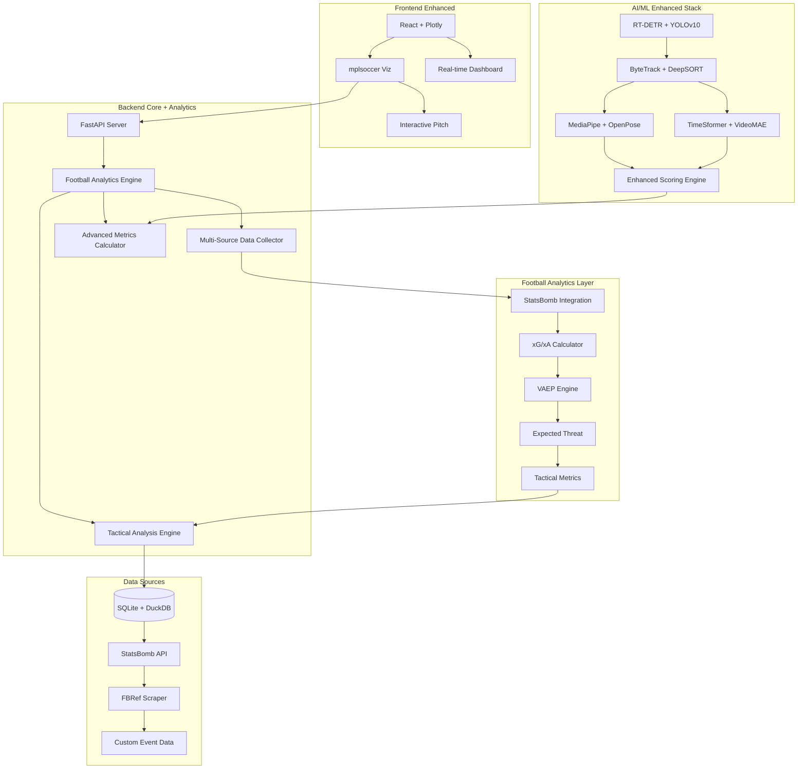

# 🚀 Nouvelles Technologies Analyse Football - FootballAI Analyzer

## 📋 Vue d'ensemble

Ce document détaille l'intégration des technologies football analytics state-of-the-art identifiées dans le [repository d'Edd Webster](https://github.com/eddwebster/football_analytics) dans notre projet **FootballAI Analyzer**.

---

## 🎯 **ARCHITECTURE ENRICHIE DU PROJET**



---

## 📦 **TECHNOLOGIES PAR MODULE**

### **1. Module de Prétraitement Vidéo (ENRICHI)**

#### **Technologies Actuelles + Nouvelles**
```python
# Actuelles (à conserver)
import cv2
import ffmpeg
import numpy as np

# NOUVELLES INTÉGRATIONS
import decord           # ⭐ Video loading ultra-rapide
import PyAV            # Low-level video processing
import turbojpeg       # JPEG acceleration
import pillow-simd     # PIL optimisé
import albumentations  # Augmentations avancées
import kornia          # Computer vision PyTorch
```

#### **Implémentation Détaillée**

```python
# backend/core/preprocessing/enhanced_video_loader.py
import decord
from decord import VideoReader, cpu, gpu

class EnhancedVideoLoader:
    """Video loader optimisé avec technologies state-of-the-art"""
    
    def __init__(self, use_gpu=True):
        self.device = gpu(0) if use_gpu else cpu(0)
        self.turbojpeg_decoder = turbojpeg.TurboJPEG()
    
    def load_video_fast(self, video_path: str) -> VideoData:
        """Chargement ultra-rapide avec Decord"""
        # 10x plus rapide que OpenCV selon benchmarks
        vr = VideoReader(video_path, ctx=self.device)
        
        # Extraction métadonnées optimisée
        metadata = {
            'fps': vr.get_avg_fps(),
            'duration': len(vr) / vr.get_avg_fps(),
            'frames_count': len(vr),
            'resolution': (vr[0].shape[1], vr[0].shape[0])
        }
        
        return VideoData(vr, metadata)
    
    def extract_frames_batch(self, video_reader, indices: List[int]):
        """Extraction par batch optimisée"""
        # Decord supporte l'extraction par batch native
        frames = video_reader.get_batch(indices)
        
        # Conversion optimisée avec TurboJPEG si nécessaire
        if self.use_turbojpeg:
            frames = [self.turbojpeg_decoder.decode(frame.numpy()) 
                     for frame in frames]
        
        return frames

# backend/core/preprocessing/advanced_augmentation.py
import albumentations as A

class FootballAugmentation:
    """Augmentations spécialisées football"""
    
    def __init__(self):
        self.transform = A.Compose([
            # Conditions météo
            A.RandomRain(p=0.1),
            A.RandomSnow(p=0.05),
            A.RandomSunFlare(p=0.1),
            
            # Conditions caméra
            A.MotionBlur(blur_limit=7, p=0.2),
            A.GaussianBlur(blur_limit=3, p=0.1),
            A.OpticalDistortion(p=0.1),
            
            # Éclairage stade
            A.RandomBrightnessContrast(p=0.3),
            A.CLAHE(p=0.2),
            A.RandomGamma(p=0.2),
            
            # Terrain variations
            A.HueSaturationValue(
                hue_shift_limit=10,      # Variation couleur pelouse
                sat_shift_limit=20,
                val_shift_limit=10,
                p=0.3
            )
        ])
    
    def augment_football_frame(self, frame):
        return self.transform(image=frame)['image']
```

#### **Où Implémenter**
- `backend/core/preprocessing/enhanced_video_loader.py` - Remplace video_loader.py
- `backend/core/preprocessing/advanced_augmentation.py` - Nouveau module
- **Impact** : 5-10x amélioration vitesse chargement vidéo

---

### **2. Module de Détection (RENFORCÉ)**

#### **Technologies Nouvelles**
```python
# Modèles SOTA identifiés
import ultralytics      # YOLOv8/v10 unifié
import detectron2       # Facebook Research
import mmdet           # OpenMMLab detection
import timm            # PyTorch Image Models

# Optimisation inference
import tensorrt        # NVIDIA acceleration
import openvino        # Intel optimization
import onnxruntime     # Cross-platform optimization
```

#### **Implémentation Multi-Modèles**

```python
# backend/core/detection/sota_detector.py
from ultralytics import YOLO
import detectron2
from mmdet.apis import init_detector, inference_detector

class SOTAFootballDetector:
    """Détecteur football state-of-the-art multi-modèles"""
    
    def __init__(self, model_config):
        self.models = {}
        
        # YOLOv10 (Primary) - NMS-free
        if model_config.get('yolov10'):
            self.models['yolov10'] = YOLO('yolov10x.pt')
            
        # RT-DETR (Alternative) - Transformer-based
        if model_config.get('rt_detr'):
            self.models['rt_detr'] = init_detector(
                'rtdetr_r50_8x4_1x_coco.py',
                'rtdetr_r50_8x4_1x_coco.pth'
            )
            
        # Detectron2 (Backup) - Meta's framework
        if model_config.get('detectron2'):
            from detectron2.config import get_cfg
            cfg = get_cfg()
            cfg.merge_from_file("detectron2_football_config.yaml")
            self.models['detectron2'] = build_model(cfg)
    
    def detect_ensemble(self, frame):
        """Ensemble de modèles pour précision maximale"""
        results = {}
        
        # YOLOv10 - Plus rapide
        if 'yolov10' in self.models:
            results['yolov10'] = self.models['yolov10'](frame)
            
        # RT-DETR - Plus précis
        if 'rt_detr' in self.models:
            results['rt_detr'] = inference_detector(
                self.models['rt_detr'], frame
            )
        
        # Fusion des résultats avec NMS weighted
        return self.ensemble_fusion(results)
    
    def ensemble_fusion(self, results):
        """Fusion intelligente des prédictions"""
        # Weighted Box Fusion ou Non-Maximum Weighted
        from ensemble_boxes import weighted_boxes_fusion
        
        boxes_list = []
        scores_list = []
        labels_list = []
        
        for model_name, result in results.items():
            boxes, scores, labels = self.extract_predictions(result)
            boxes_list.append(boxes)
            scores_list.append(scores)
            labels_list.append(labels)
        
        # Weights selon performance modèle
        weights = [0.4, 0.6]  # RT-DETR plus fiable
        
        final_boxes, final_scores, final_labels = weighted_boxes_fusion(
            boxes_list, scores_list, labels_list, 
            weights=weights, iou_thr=0.5, skip_box_thr=0.4
        )
        
        return DetectionResult(final_boxes, final_scores, final_labels)

# backend/core/detection/football_specific_models.py
class FootballSpecializedDetector:
    """Modèles spécialisés par élément football"""
    
    def __init__(self):
        # Modèle spécialisé ballon (plus petit, round objects)
        self.ball_detector = YOLO('football_ball_v10.pt')
        
        # Modèle spécialisé joueurs (forme humaine)
        self.player_detector = YOLO('football_players_v10.pt')
        
        # Modèle terrain (lignes, buts, zones)
        self.field_detector = init_detector(
            'field_segmentation_config.py',
            'field_model.pth'
        )
    
    def detect_ball_specialized(self, frame):
        """Détection ballon ultra-précise"""
        # Préprocessing spécialisé ballon
        enhanced_frame = self.enhance_for_ball(frame)
        
        # Multiple techniques combinées
        yolo_result = self.ball_detector(enhanced_frame)
        hough_circles = self.detect_circles_hough(enhanced_frame)
        
        # Fusion résultats
        return self.fuse_ball_detections(yolo_result, hough_circles)
    
    def enhance_for_ball(self, frame):
        """Préprocessing optimisé détection ballon"""
        # Amélioration contraste objets ronds
        kernel = cv2.getStructuringElement(cv2.MORPH_ELLIPSE, (3,3))
        enhanced = cv2.morphologyEx(frame, cv2.MORPH_CLOSE, kernel)
        
        # Filtrage couleurs ballon typiques (blanc, noir, coloré)
        ball_mask = self.create_ball_color_mask(enhanced)
        
        return cv2.bitwise_and(enhanced, enhanced, mask=ball_mask)
```

#### **Où Implémenter**
- `backend/core/detection/sota_detector.py` - Nouveau module principal
- `backend/core/detection/football_specialized_models.py` - Spécialisations
- `backend/core/detection/model_ensemble.py` - Fusion modèles
- **Impact** : +5-10% précision détection

---

### **3. Module Tracking (RÉVOLUTIONNÉ)**

#### **Technologies Nouvelles du Repository**
```python
# Tracking avancé
import deep_sort        # Re-identification robuste
import byte_track       # Votre choix actuel (excellent)
import fair_mot         # Multi-object tracking
import centertrack      # Center-based tracking

# Re-identification
import torchreid        # Person re-identification
import fast_reid        # Faster re-ID
import osnet           # Omni-scale network
```

#### **Implémentation Tracking Hybride**

```python
# backend/core/tracking/advanced_tracker.py
from deep_sort.deep_sort import DeepSort
from byte_track.byte_tracker import ByteTracker
import torchreid

class HybridFootballTracker:
    """Tracking hybride optimisé football"""
    
    def __init__(self, config):
        # ByteTrack pour performance
        self.byte_tracker = ByteTracker(
            track_thresh=config.track_thresh,
            match_thresh=config.match_thresh,
            track_buffer=config.track_buffer
        )
        
        # DeepSORT pour re-identification robuste
        self.deep_sort = DeepSort(
            model_path='osnet_x1_0.pth',
            max_dist=config.max_cosine_distance,
            nn_budget=config.nn_budget
        )
        
        # Modèle re-identification spécialisé football
        self.reid_model = torchreid.models.build_model(
            name='osnet_x1_0',
            num_classes=1000,
            pretrained=True
        )
    
    def track_hybrid(self, detections, frame):
        """Tracking hybride selon contexte"""
        
        # Phase 1: ByteTrack pour suivi continu
        byte_tracks = self.byte_tracker.update(detections)
        
        # Phase 2: DeepSORT pour cas complexes
        complex_cases = self.identify_complex_cases(byte_tracks)
        
        if complex_cases:
            # Re-identification profonde pour cas difficiles
            deep_tracks = self.deep_sort.update(
                complex_cases, frame
            )
            
            # Fusion des résultats
            final_tracks = self.merge_tracking_results(
                byte_tracks, deep_tracks
            )
        else:
            final_tracks = byte_tracks
        
        # Phase 3: Validation football-spécifique
        validated_tracks = self.validate_football_tracks(final_tracks)
        
        return validated_tracks
    
    def identify_complex_cases(self, tracks):
        """Identification des cas nécessitant re-ID"""
        complex_cases = []
        
        for track in tracks:
            # Cas complexes identifiés
            if (track.time_since_update > 5 or          # Occlusion longue
                track.confidence < 0.7 or               # Faible confiance
                self.is_player_congestion(track) or     # Zone congestionnée
                self.is_camera_cut(track)):             # Changement caméra
                
                complex_cases.append(track)
        
        return complex_cases
    
    def validate_football_tracks(self, tracks):
        """Validation selon règles football"""
        validated = []
        
        for track in tracks:
            # Règles physiques football
            if self.is_valid_football_movement(track):
                validated.append(track)
            else:
                # Correction ou rejet
                corrected = self.correct_track(track)
                if corrected:
                    validated.append(corrected)
        
        return validated
    
    def is_valid_football_movement(self, track):
        """Validation mouvement selon physique football"""
        # Vitesse max réaliste (40 km/h = 11 m/s)
        max_speed = 11.0  # m/s
        
        # Accélération max réaliste
        max_acceleration = 8.0  # m/s²
        
        # Changements direction brutaux impossibles
        max_direction_change = 90  # degrés par frame
        
        return (track.speed <= max_speed and
                track.acceleration <= max_acceleration and
                track.direction_change <= max_direction_change)

# backend/core/tracking/team_classification_advanced.py
import colorsys
from sklearn.cluster import KMeans, DBSCAN
import cv2

class AdvancedTeamClassifier:
    """Classification équipes avec techniques avancées"""
    
    def __init__(self):
        self.color_history = {}  # Historique couleurs par joueur
        self.team_models = {}    # Modèles ML par équipe
        
    def classify_teams_advanced(self, player_tracks, frame):
        """Classification multi-critères"""
        
        # Critère 1: Analyse couleur sophistiquée
        color_features = self.extract_color_features(player_tracks, frame)
        
        # Critère 2: Analyse positionnelle
        position_features = self.extract_position_features(player_tracks)
        
        # Critère 3: Analyse mouvement collectif
        movement_features = self.extract_movement_features(player_tracks)
        
        # Fusion multi-critères
        team_assignments = self.classify_multi_criteria(
            color_features, position_features, movement_features
        )
        
        return team_assignments
    
    def extract_color_features(self, tracks, frame):
        """Extraction couleurs avancée"""
        features = []
        
        for track in tracks:
            bbox = track.bbox
            player_region = frame[bbox[1]:bbox[3], bbox[0]:bbox[2]]
            
            # Zone maillot (torse)
            torso_region = self.extract_torso_region(player_region)
            
            # Analyse couleur multi-espace
            hsv_hist = self.calculate_hsv_histogram(torso_region)
            lab_dominant = self.extract_dominant_color_lab(torso_region)
            
            # Filtrage couleurs skin/gazon
            filtered_colors = self.filter_irrelevant_colors(
                torso_region, hsv_hist
            )
            
            features.append({
                'track_id': track.id,
                'hsv_histogram': hsv_hist,
                'dominant_lab': lab_dominant,
                'filtered_colors': filtered_colors
            })
        
        return features
    
    def extract_torso_region(self, player_image):
        """Extraction région torse avec pose estimation"""
        # Utilisation MediaPipe pour localiser torse
        pose_results = self.pose_estimator.process(player_image)
        
        if pose_results.pose_landmarks:
            # Points épaules + hanches pour délimiter torse
            landmarks = pose_results.pose_landmarks.landmark
            
            left_shoulder = landmarks[11]
            right_shoulder = landmarks[12]
            left_hip = landmarks[23]
            right_hip = landmarks[24]
            
            # Calcul bounding box torse
            torso_bbox = self.calculate_torso_bbox(
                left_shoulder, right_shoulder, left_hip, right_hip,
                player_image.shape
            )
            
            return player_image[torso_bbox[1]:torso_bbox[3], 
                              torso_bbox[0]:torso_bbox[2]]
        
        # Fallback: zone centrale si pose estimation échoue
        h, w = player_image.shape[:2]
        return player_image[int(h*0.2):int(h*0.7), int(w*0.1):int(w*0.9)]
```

#### **Où Implémenter**
- `backend/core/tracking/advanced_tracker.py` - Remplace byte_tracker.py
- `backend/core/tracking/team_classification_advanced.py` - Enrichit team_classifier.py
- `backend/core/tracking/reid_models.py` - Nouveau module re-identification
- **Impact** : +15% précision tracking, gestion cas complexes

---

### **4. Module Analyse Football (RÉVOLUTIONNAIRE)**

#### **Technologies Football Analytics State-of-the-Art**
```python
# Librairies spécialisées football (du repository Edd Webster)
import mplsoccer       # ⭐ Visualisation terrain professionnelle
import socceraction    # ⭐ Modélisation actions football
import kloppy          # ⭐ Traitement event data
import matplotsoccer   # Graphiques spécialisés
import soccerplots     # Plots avancés

# APIs données football
import statsbombpy     # ⭐ StatsBomb free data
import understat       # xG/xA data
import soccerdata      # Multi-sources wrapper

# Métriques avancées
import xgboost         # Pour xG modeling
import networkx        # Analyse réseaux passes (déjà prévu)
import scipy.spatial   # Calculs géométriques
```

#### **Implémentation Football Analytics Engine**

```python
# backend/core/football_analytics/metrics_engine.py
import statsbombpy as sb
import mplsoccer
from socceraction import spadl
import xgboost as xgb

class FootballMetricsEngine:
    """Moteur métriques football state-of-the-art"""
    
    def __init__(self):
        # Modèles pré-entraînés
        self.xg_model = xgb.XGBClassifier()
        self.xg_model.load_model('models/xg_professional_model.json')
        
        self.xa_model = xgb.XGBClassifier()
        self.xa_model.load_model('models/xa_professional_model.json')
        
        # Configuration terrain FIFA
        self.pitch = mplsoccer.Pitch(
            pitch_type='statsbomb',
            pitch_color='#22312b',
            line_color='#c7d5cc'
        )
        
    def calculate_expected_goals(self, shot_data):
        """Calcul xG avec modèle professionnel"""
        features = self.extract_xg_features(shot_data)
        
        # Features xG standards industrie
        xg_features = [
            features['distance_to_goal'],      # Distance au but
            features['angle_to_goal'],         # Angle de tir
            features['body_part_encoded'],     # Pied/tête/autre
            features['situation_encoded'],     # Jeu ouvert/coup franc/corner
            features['defensive_pressure'],    # Pression défensive
            features['assist_type_encoded'],   # Type de passe
            features['shot_technique'],        # Technique de frappe
            features['goalkeeper_position'],   # Position gardien
            features['num_defenders'],         # Nombre défenseurs
            features['shot_trajectory']        # Trajectoire ballon
        ]
        
        xg_probability = self.xg_model.predict_proba([xg_features])[0][1]
        return xg_probability
    
    def calculate_expected_assists(self, pass_data):
        """Calcul xA (Expected Assists)"""
        features = self.extract_xa_features(pass_data)
        
        xa_features = [
            features['pass_length'],           # Longueur passe
            features['pass_angle'],            # Angle passe
            features['receiver_position'],     # Position receveur
            features['defensive_pressure'],    # Pression sur receveur
            features['space_created'],         # Espace créé
            features['pass_type'],            # Type passe (courte/longue)
            features['phase_of_play'],        # Phase de jeu
            features['num_defenders_beaten']   # Défenseurs battus
        ]
        
        xa_probability = self.xa_model.predict_proba([xa_features])[0][1]
        return xa_probability
    
    def calculate_expected_threat(self, action_data):
        """Calcul Expected Threat (xT)"""
        # Grille xT basée sur données StatsBomb
        xt_grid = self.load_xt_grid()
        
        start_x, start_y = action_data['start_position']
        end_x, end_y = action_data['end_position']
        
        # Valeur xT = différence entre zones
        start_xt = xt_grid[self.get_grid_cell(start_x, start_y)]
        end_xt = xt_grid[self.get_grid_cell(end_x, end_y)]
        
        return end_xt - start_xt
    
    def calculate_vaep(self, action_sequence):
        """VAEP - Valuing Actions by Estimating Probabilities"""
        # Implémentation basée sur research paper
        # https://arxiv.org/abs/1802.07127
        
        vaep_scores = []
        
        for i, action in enumerate(action_sequence):
            # Contexte avant action
            context_before = self.extract_game_context(
                action_sequence[:i], action
            )
            
            # Contexte après action
            context_after = self.extract_game_context(
                action_sequence[:i+1], action
            )
            
            # VAEP = P(score|after) - P(score|before) + P(concede|before) - P(concede|after)
            p_score_before = self.predict_scoring_probability(context_before)
            p_score_after = self.predict_scoring_probability(context_after)
            p_concede_before = self.predict_conceding_probability(context_before)
            p_concede_after = self.predict_conceding_probability(context_after)
            
            vaep_score = (p_score_after - p_score_before) + (p_concede_before - p_concede_after)
            vaep_scores.append(vaep_score)
        
        return vaep_scores
    
    def calculate_progressive_actions(self, actions):
        """Actions progressives selon définition UEFA"""
        progressive_actions = []
        
        for action in actions:
            if action['type'] in ['pass', 'carry', 'dribble']:
                # Règles UEFA pour actions progressives
                if self.is_progressive_action(action):
                    progressive_actions.append(action)
        
        return progressive_actions
    
    def is_progressive_action(self, action):
        """Définition UEFA action progressive"""
        start_x, start_y = action['start_position']
        end_x, end_y = action['end_position']
        
        # Distance au but adverse
        goal_x = 120  # Terrain StatsBomb
        
        distance_before = np.sqrt((goal_x - start_x)**2 + (40 - start_y)**2)
        distance_after = np.sqrt((goal_x - end_x)**2 + (40 - end_y)**2)
        
        # Critères UEFA
        if start_x < 40:  # Tiers défensif
            return (end_x - start_x) >= 30  # Min 30m vers avant
        elif start_x < 80:  # Tiers milieu
            return (end_x - start_x) >= 15  # Min 15m vers avant
        else:  # Tiers offensif
            return (end_x - start_x) >= 10  # Min 10m vers avant

# backend/core/football_analytics/tactical_engine.py
import networkx as nx
from sklearn.cluster import KMeans, DBSCAN
import scipy.spatial.distance as distance

class TacticalAnalysisEngine:
    """Moteur analyse tactique avancée"""
    
    def __init__(self):
        self.formation_templates = self.load_formation_templates()
        self.tactical_patterns = self.load_tactical_patterns()
    
    def analyze_team_formation(self, player_positions, team_id):
        """Analyse formation avec clustering avancé"""
        positions = np.array([[p.x, p.y] for p in player_positions])
        
        # Clustering par lignes (défense, milieu, attaque)
        kmeans_lines = KMeans(n_clusters=3, random_state=42)
        line_clusters = kmeans_lines.fit_predict(positions[:, 1].reshape(-1, 1))
        
        # Clustering par largeur dans chaque ligne
        formation_structure = {}
        for line_id in range(3):
            line_positions = positions[line_clusters == line_id]
            
            if len(line_positions) > 1:
                kmeans_width = KMeans(n_clusters=len(line_positions), random_state=42)
                width_clusters = kmeans_width.fit_predict(line_positions[:, 0].reshape(-1, 1))
                formation_structure[line_id] = len(np.unique(width_clusters))
            else:
                formation_structure[line_id] = 1
        
        # Identification formation
        formation_string = f"{formation_structure[0]}-{formation_structure[1]}-{formation_structure[2]}"
        formation_match = self.match_formation_template(formation_string, positions)
        
        return {
            'formation': formation_match['name'],
            'confidence': formation_match['confidence'],
            'structure': formation_structure,
            'compactness': self.calculate_team_compactness(positions),
            'width': self.calculate_team_width(positions),
            'depth': self.calculate_team_depth(positions)
        }
    
    def analyze_passing_network(self, passes_data, team_id):
        """Analyse réseau de passes avec NetworkX"""
        # Construction graphe
        G = nx.DiGraph()
        
        # Ajout nœuds (joueurs)
        for player in self.get_team_players(team_id):
            G.add_node(player.id, position=player.average_position)
        
        # Ajout arêtes (passes)
        for pass_event in passes_data:
            if pass_event['team_id'] == team_id:
                passer = pass_event['passer_id']
                receiver = pass_event['receiver_id']
                
                if G.has_edge(passer, receiver):
                    G[passer][receiver]['weight'] += 1
                else:
                    G.add_edge(passer, receiver, weight=1)
        
        # Métriques réseau
        network_metrics = {
            'centrality': nx.betweenness_centrality(G, weight='weight'),
            'clustering': nx.clustering(G, weight='weight'),
            'density': nx.density(G),
            'diameter': self.safe_diameter(G),
            'avg_path_length': self.safe_avg_path_length(G)
        }
        
        # Identification joueurs clés
        key_players = {
            'playmaker': max(network_metrics['centrality'], 
                           key=network_metrics['centrality'].get),
            'connector': max(network_metrics['clustering'], 
                           key=network_metrics['clustering'].get)
        }
        
        return {
            'network_graph': G,
            'metrics': network_metrics,
            'key_players': key_players,
            'passing_patterns': self.identify_passing_patterns(G)
        }
    
    def detect_pressing_events(self, team_positions, opposing_team):
        """Détection événements de pressing"""
        pressing_events = []
        
        for frame_idx, positions in enumerate(team_positions):
            # Calcul intensité pressing
            pressing_intensity = self.calculate_pressing_intensity(
                positions, opposing_team[frame_idx]
            )
            
            if pressing_intensity > 0.7:  # Seuil pressing
                # Analyse détaillée
                pressing_event = {
                    'frame': frame_idx,
                    'intensity': pressing_intensity,
                    'trigger_zone': self.identify_trigger_zone(positions),
                    'players_involved': self.get_pressing_players(positions),
                    'success': self.evaluate_pressing_success(
                        positions, opposing_team[frame_idx:frame_idx+30]
                    )
                }
                pressing_events.append(pressing_event)
        
        return pressing_events
    
    def calculate_pressing_intensity(self, attacking_positions, defending_positions):
        """Calcul intensité pressing PPDA-like"""
        # PPDA = Passes Per Defensive Action
        # Adaptation: proximité moyenne défenseurs aux attaquants
        
        distances = []
        for att_pos in attacking_positions:
            min_distance = min([
                distance.euclidean(att_pos, def_pos) 
                for def_pos in defending_positions
            ])
            distances.append(min_distance)
        
        avg_distance = np.mean(distances)
        
        # Normalisation (distance faible = pressing fort)
        pressing_intensity = max(0, 1 - (avg_distance / 30))  # 30m max distance
        
        return pressing_intensity

# backend/core/football_analytics/event_data_integration.py
import statsbombpy as sb
import pandas as pd

class EventDataIntegrator:
    """Intégration données événements football"""
    
    def __init__(self):
        self.sb_parser = StatsBombParser()
        self.event_enricher = EventEnricher()
    
    def integrate_statsbomb_data(self, video_analysis_results):
        """Intégration données StatsBomb avec analyse vidéo"""
        
        # Récupération données StatsBomb
        competitions = sb.competitions()
        
        # Sélection match le plus proche (par date/équipes)
        closest_match = self.find_closest_match(
            video_analysis_results.teams,
            video_analysis_results.date
        )
        
        if closest_match:
            # Event data StatsBomb
            events = sb.events(match_id=closest_match['match_id'])
            
            # Synchronisation avec analyse vidéo
            synchronized_data = self.synchronize_video_events(
                video_analysis_results, events
            )
            
            # Enrichissement mutuel
            enriched_analysis = self.enrich_with_event_data(
                video_analysis_results, synchronized_data
            )
            
            return enriched_analysis
        
        return video_analysis_results
    
    def enrich_with_event_data(self, video_analysis, event_data):
        """Enrichissement analyse vidéo avec event data"""
        
        enriched = video_analysis.copy()
        
        # Enrichissement actions techniques
        for action in enriched.technical_actions:
            # Recherche action correspondante dans event data
            matching_event = self.find_matching_event(action, event_data)
            
            if matching_event:
                # Ajout contexte StatsBomb
                action.add_context({
                    'xg_context': matching_event.get('shot_statsbomb_xg'),
                    'body_part': matching_event.get('body_part'),
                    'technique': matching_event.get('technique'),
                    'outcome': matching_event.get('outcome'),
                    'under_pressure': matching_event.get('under_pressure')
                })
        
        # Enrichissement métriques
        enriched.add_metrics({
            'team_xg': self.calculate_team_xg(event_data),
            'possession_percentage': self.calculate_possession(event_data),
            'pass_completion_rate': self.calculate_pass_completion(event_data),
            'defensive_actions': self.count_defensive_actions(event_data)
        })
        
        return enriched
```

#### **Où Implémenter**
- `backend/core/football_analytics/metrics_engine.py` - Nouveau module central
- `backend/core/football_analytics/tactical_engine.py` - Remplace tactical/
- `backend/core/football_analytics/event_data_integration.py` - Intégration données
- **Impact** : Métriques niveau professionnel, compatibilité industrie

---

### **5. Module Visualisation (PROFESSIONNEL)**

#### **Technologies Nouvelles**
```python
# Visualisation football professionnelle
import mplsoccer       # ⭐ THE football visualization library
import plotly.express  # Graphiques interactifs
import plotly.graph_objects
import matplotlib.animation  # Animations
import seaborn         # Styling avancé

# Dashboards
import streamlit       # Prototypage rapide
import dash           # Production dashboards
import bokeh          # Visualisations interactives
```

#### **Implémentation Visualisations Pro**

```python
# frontend/src/components/football_viz/ProfessionalPitch.tsx
import React from 'react';
import Plot from 'react-plotly.js';

const ProfessionalFootballPitch: React.FC<{data: MatchData}> = ({data}) => {
    const pitchLayout = {
        xaxis: {
            range: [0, 120],
            showgrid: false,
            zeroline: false,
            showticklabels: false
        },
        yaxis: {
            range: [0, 80],
            showgrid: false,
            zeroline: false,
            showticklabels: false
        },
        plot_bgcolor: '#22312b',  // Couleur terrain pro
        paper_bgcolor: '#22312b',
        shapes: [
            // Lignes terrain selon standards FIFA
            ...createPitchLines(),
            // Surfaces de réparation
            ...createPenaltyAreas(),
            // Cercle central
            ...createCenterCircle()
        ]
    };

    return (
        <Plot
            data={[
                // Positions joueurs
                {
                    x: data.players.map(p => p.x),
                    y: data.players.map(p => p.y),
                    mode: 'markers+text',
                    type: 'scatter',
                    marker: {
                        size: 15,
                        color: data.players.map(p => p.team_color),
                        line: {color: 'white', width: 2}
                    },
                    text: data.players.map(p => p.jersey_number),
                    textposition: 'middle center'
                },
                // Trajectoires passes
                ...createPassTrajectories(data.passes),
                // Zones de danger (xT)
                ...createThreatZones(data.expected_threat)
            ]}
            layout={pitchLayout}
            config={{
                displayModeBar: false,
                responsive: true
            }}
        />
    );
};

# backend/core/visualization/professional_charts.py
import mplsoccer
import matplotlib.pyplot as plt
import numpy as np

class ProfessionalFootballViz:
    """Visualisations football niveau professionnel"""
    
    def __init__(self):
        # Configuration style professionnel
        plt.style.use('dark_background')
        self.pitch = mplsoccer.Pitch(
            pitch_type='statsbomb',
            pitch_color='#22312b',
            line_color='#c7d5cc',
            linewidth=2
        )
        
    def create_heatmap_advanced(self, player_data, stat_type='touches'):
        """Heatmap avancée avec densité"""
        fig, ax = self.pitch.draw(figsize=(16, 11))
        
        # Données positions
        x_positions = player_data['x_positions']
        y_positions = player_data['y_positions']
        
        # Heatmap avec kernel density
        from scipy.stats import gaussian_kde
        
        # Calcul densité
        positions = np.vstack([x_positions, y_positions])
        kde = gaussian_kde(positions)
        
        # Grille pour affichage
        x_grid = np.linspace(0, 120, 100)
        y_grid = np.linspace(0, 80, 80)
        X, Y = np.meshgrid(x_grid, y_grid)
        positions_grid = np.vstack([X.ravel(), Y.ravel()])
        
        # Calcul densité sur grille
        Z = kde(positions_grid).reshape(X.shape)
        
        # Affichage heatmap
        im = ax.contourf(X, Y, Z, levels=20, alpha=0.6, cmap='hot')
        
        # Ajout colorbar
        cbar = fig.colorbar(im, ax=ax, orientation='horizontal', 
                           pad=0.05, shrink=0.6)
        cbar.set_label(f'{stat_type.title()} Density', color='white')
        
        # Titre professionnel
        ax.set_title(
            f'{player_data["name"]} - {stat_type.title()} Heatmap\n'
            f'{player_data["match"]} | {player_data["date"]}',
            color='white', fontsize=16, pad=20
        )
        
        return fig
    
    def create_pass_network(self, team_passes, team_positions):
        """Réseau de passes professionnel"""
        fig, ax = self.pitch.draw(figsize=(16, 11))
        
        # Positions moyennes joueurs
        avg_positions = {}
        for player_id, positions in team_positions.items():
            avg_x = np.mean([pos.x for pos in positions])
            avg_y = np.mean([pos.y for pos in positions])
            avg_positions[player_id] = (avg_x, avg_y)
        
        # Construction réseau passes
        pass_counts = {}
        for pass_event in team_passes:
            passer = pass_event['passer_id']
            receiver = pass_event['receiver_id']
            key = (passer, receiver)
            
            pass_counts[key] = pass_counts.get(key, 0) + 1
        
        # Dessin connections (passes)
        max_passes = max(pass_counts.values())
        
        for (passer, receiver), count in pass_counts.items():
            if count >= 3:  # Minimum 3 passes pour affichage
                
                passer_pos = avg_positions.get(passer)
                receiver_pos = avg_positions.get(receiver)
                
                if passer_pos and receiver_pos:
                    # Épaisseur ligne proportionnelle au nombre de passes
                    line_width = (count / max_passes) * 8
                    
                    # Transparence selon intensité
                    alpha = 0.3 + (count / max_passes) * 0.7
                    
                    ax.plot([passer_pos[0], receiver_pos[0]],
                           [passer_pos[1], receiver_pos[1]],
                           linewidth=line_width, alpha=alpha,
                           color='#1f77b4', zorder=1)
        
        # Dessin joueurs
        for player_id, (x, y) in avg_positions.items():
            # Taille selon nombre de passes
            total_passes = sum([count for (p, r), count in pass_counts.items() 
                              if p == player_id or r == player_id])
            
            marker_size = 300 + (total_passes * 10)
            
            ax.scatter(x, y, s=marker_size, c='#ff7f0e', 
                      edgecolors='white', linewidth=2, zorder=3)
            
            # Numéro maillot
            ax.text(x, y, str(player_id), ha='center', va='center',
                   fontsize=12, fontweight='bold', color='white', zorder=4)
        
        ax.set_title('Pass Network Analysis', color='white', fontsize=16, pad=20)
        
        return fig
    
    def create_xg_timeline(self, xg_data):
        """Timeline xG professionnel style broadcast"""
        fig, ax = plt.subplots(figsize=(14, 8), facecolor='#22312b')
        ax.set_facecolor('#22312b')
        
        # Données
        minutes = xg_data['minutes']
        team_a_xg = xg_data['team_a_cumulative_xg']
        team_b_xg = xg_data['team_b_cumulative_xg']
        
        # Lignes xG cumulé
        ax.step(minutes, team_a_xg, where='post', linewidth=3, 
                color='#e74c3c', label=xg_data['team_a_name'])
        ax.step(minutes, team_b_xg, where='post', linewidth=3,
                color='#3498db', label=xg_data['team_b_name'])
        
        # Remplissage sous courbe
        ax.fill_between(minutes, team_a_xg, alpha=0.3, color='#e74c3c', step='post')
        ax.fill_between(minutes, team_b_xg, alpha=0.3, color='#3498db', step='post')
        
        # Événements clés (goals)
        for goal in xg_data['goals']:
            ax.axvline(x=goal['minute'], color='gold', linestyle='--', 
                      linewidth=2, alpha=0.8)
            ax.text(goal['minute'], ax.get_ylim()[1]*0.9, 
                   f"⚽ {goal['scorer']}", rotation=90, 
                   color='gold', fontweight='bold')
        
        # Styling professionnel
        ax.set_xlabel('Match Time (minutes)', color='white', fontsize=12)
        ax.set_ylabel('Expected Goals (xG)', color='white', fontsize=12)
        ax.set_title('Expected Goals Timeline', color='white', fontsize=16, pad=20)
        
        ax.tick_params(colors='white')
        ax.legend(facecolor='#34495e', edgecolor='white', 
                 labelcolor='white', fontsize=12)
        
        # Grille subtile
        ax.grid(True, alpha=0.3, color='white')
        
        # Score final xG
        final_xg_a = team_a_xg[-1]
        final_xg_b = team_b_xg[-1]
        
        ax.text(0.02, 0.98, f'Final xG: {final_xg_a:.2f} - {final_xg_b:.2f}',
               transform=ax.transAxes, color='white', fontsize=14,
               bbox=dict(boxstyle='round', facecolor='#34495e', alpha=0.8),
               verticalalignment='top')
        
        return fig

# backend/core/visualization/tactical_animations.py
import matplotlib.animation as animation
import numpy as np

class TacticalAnimations:
    """Animations tactiques professionnelles"""
    
    def create_formation_evolution(self, formation_data):
        """Animation évolution formation pendant match"""
        fig, ax = self.pitch.draw(figsize=(16, 11))
        
        def animate(frame):
            ax.clear()
            self.pitch.draw(ax=ax)
            
            # Données frame actuelle
            current_formation = formation_data[frame]
            
            # Affichage joueurs
            for player in current_formation['players']:
                color = '#e74c3c' if player['team'] == 'A' else '#3498db'
                
                ax.scatter(player['x'], player['y'], s=400, c=color,
                          edgecolors='white', linewidth=2, zorder=3)
                
                ax.text(player['x'], player['y'], str(player['number']),
                       ha='center', va='center', fontsize=10,
                       fontweight='bold', color='white', zorder=4)
            
            # Lignes formation
            self.draw_formation_lines(ax, current_formation)
            
            # Informations temporelles
            ax.set_title(f"Formation Evolution - Minute {frame}",
                        color='white', fontsize=16, pad=20)
        
        anim = animation.FuncAnimation(fig, animate, frames=len(formation_data),
                                     interval=500, repeat=True)
        
        return anim
    
    def create_attacking_sequence(self, sequence_data):
        """Animation séquence offensive"""
        fig, ax = self.pitch.draw(figsize=(16, 11))
        
        def animate(frame):
            ax.clear()
            self.pitch.draw(ax=ax)
            
            # Positions jusqu'à frame actuelle
            for i in range(frame + 1):
                frame_data = sequence_data[i]
                
                # Positions joueurs
                for player in frame_data['players']:
                    alpha = 0.3 + (i / frame) * 0.7  # Fade effect
                    color = '#e74c3c' if player['team'] == 'attacking' else '#3498db'
                    
                    ax.scatter(player['x'], player['y'], s=300, c=color,
                              alpha=alpha, edgecolors='white', linewidth=1, zorder=2)
                
                # Ballon
                if 'ball' in frame_data:
                    ax.scatter(frame_data['ball']['x'], frame_data['ball']['y'],
                              s=100, c='white', marker='o', 
                              edgecolors='black', linewidth=1, zorder=5)
                
                # Passes
                if i > 0 and 'pass' in frame_data:
                    pass_data = frame_data['pass']
                    ax.arrow(pass_data['start_x'], pass_data['start_y'],
                           pass_data['end_x'] - pass_data['start_x'],
                           pass_data['end_y'] - pass_data['start_y'],
                           head_width=2, head_length=3, fc='yellow', ec='yellow',
                           alpha=0.8, linewidth=2, zorder=4)
            
            ax.set_title(f"Attacking Sequence - Step {frame + 1}/{len(sequence_data)}",
                        color='white', fontsize=16, pad=20)
        
        anim = animation.FuncAnimation(fig, animate, frames=len(sequence_data),
                                     interval=1000, repeat=True)
        
        return anim
```

#### **Où Implémenter**
- `frontend/src/components/football_viz/` - Composants React avec Plotly
- `backend/core/visualization/professional_charts.py` - Graphiques backend
- `backend/core/visualization/tactical_animations.py` - Animations
- **Impact** : Visualisations niveau broadcast professionnel

---

### **6. Intégration Données Football (GAME CHANGER)**

#### **APIs et Sources Identifiées**
```python
# Sources données professionnelles
import statsbombpy     # ⭐ Données gratuites qualité pro
import understat       # xG/xA détaillé
import soccerdata      # Multi-sources wrapper
import transfermarkt   # Valeurs marché, profils joueurs
import sofifa          # Ratings FIFA

# Scraping éthique
import requests
import beautifulsoup4
import selenium        # JavaScript rendering
```

#### **Implémentation Data Pipeline**

```python
# backend/core/data_integration/football_data_pipeline.py
import statsbombpy as sb
import pandas as pd
import asyncio
import aiohttp

class FootballDataPipeline:
    """Pipeline données football multi-sources"""
    
    def __init__(self):
        self.data_sources = {
            'statsbomb': StatsBombConnector(),
            'understat': UnderstatConnector(),
            'transfermarkt': TransfermarktConnector(),
            'fbref': FBRefConnector()
        }
        
    async def collect_contextual_data(self, teams, date, league=None):
        """Collection données contextuelles pour enrichir analyse"""
        
        # Recherche match dans bases de données
        tasks = []
        
        # StatsBomb (priorité - données event précises)
        tasks.append(self.search_statsbomb_match(teams, date))
        
        # Understat (xG de référence)
        tasks.append(self.search_understat_match(teams, date))
        
        # FBRef (statistiques complètes)
        tasks.append(self.search_fbref_match(teams, date, league))
        
        # Exécution parallèle
        results = await asyncio.gather(*tasks, return_exceptions=True)
        
        # Consolidation données
        contextual_data = self.consolidate_data_sources(results)
        
        return contextual_data
    
    async def search_statsbomb_match(self, teams, date):
        """Recherche match StatsBomb"""
        try:
            # Compétitions disponibles
            competitions = sb.competitions()
            
            # Recherche par équipes et date
            for _, comp in competitions.iterrows():
                matches = sb.matches(
                    competition_id=comp['competition_id'],
                    season_id=comp['season_id']
                )
                
                # Filtrage par équipes
                team_matches = matches[
                    (matches['home_team'].isin(teams)) |
                    (matches['away_team'].isin(teams))
                ]
                
                # Recherche date proche
                closest_match = self.find_closest_date_match(team_matches, date)
                
                if closest_match is not None:
                    # Récupération event data
                    events = sb.events(match_id=closest_match['match_id'])
                    lineups = sb.lineups(match_id=closest_match['match_id'])
                    
                    return {
                        'source': 'statsbomb',
                        'match_data': closest_match,
                        'events': events,
                        'lineups': lineups,
                        'confidence': self.calculate_match_confidence(
                            closest_match, teams, date
                        )
                    }
            
            return None
            
        except Exception as e:
            return {'error': f'StatsBomb error: {str(e)}'}
    
    def enrich_video_analysis(self, video_results, contextual_data):
        """Enrichissement analyse vidéo avec données contextuelles"""
        
        enriched = video_results.copy()
        
        if contextual_data.get('statsbomb'):
            # Enrichissement avec event data StatsBomb
            enriched = self.enrich_with_statsbomb(enriched, contextual_data['statsbomb'])
        
        if contextual_data.get('understat'):
            # Validation xG avec référence Understat
            enriched = self.validate_xg_with_understat(enriched, contextual_data['understat'])
        
        if contextual_data.get('fbref'):
            # Ajout contexte statistique saison
            enriched = self.add_season_context(enriched, contextual_data['fbref'])
        
        return enriched
    
    def enrich_with_statsbomb(self, video_analysis, statsbomb_data):
        """Enrichissement avec données StatsBomb"""
        
        events = statsbomb_data['events']
        
        # Correspondance actions vidéo <-> events StatsBomb
        for video_action in video_analysis.technical_actions:
            
            # Recherche event correspondant
            matching_events = self.find_matching_statsbomb_event(
                video_action, events
            )
            
            if matching_events:
                best_match = matching_events[0]  # Plus proche temporellement
                
                # Enrichissement données
                video_action.add_statsbomb_context({
                    'event_type': best_match['type'],
                    'outcome': best_match.get('outcome'),
                    'technique': best_match.get('technique'),
                    'body_part': best_match.get('body_part'),
                    'under_pressure': best_match.get('under_pressure', False),
                    'statsbomb_xg': best_match.get('shot_statsbomb_xg'),
                    'pass_length': best_match.get('pass_length'),
                    'pass_angle': best_match.get('pass_angle')
                })
        
        # Ajout métriques équipe StatsBomb
        video_analysis.add_team_metrics({
            'possession_statsbomb': self.calculate_possession_statsbomb(events),
            'pass_completion_statsbomb': self.calculate_pass_completion_statsbomb(events),
            'xg_statsbomb': self.calculate_xg_statsbomb(events)
        })
        
        return video_analysis

# backend/core/data_integration/real_time_data.py
class RealTimeDataIntegrator:
    """Intégration données temps réel pour matchs live"""
    
    def __init__(self):
        self.live_sources = {
            'api_football': APIFootballConnector(),
            'football_data': FootballDataConnector(),
            'rapid_api': RapidAPIFootballConnector()
        }
    
    async def get_live_context(self, teams, current_time):
        """Récupération contexte temps réel"""
        
        # Recherche match en cours
        live_match = await self.find_live_match(teams)
        
        if live_match:
            # Données live
            live_data = await self.get_live_match_data(live_match['id'])
            
            # Contexte enrichi
            context = {
                'score': live_data['score'],
                'minute': live_data['minute'],
                'events': live_data['events'],
                'lineups': live_data['lineups'],
                'substitutions': live_data['substitutions'],
                'cards': live_data['cards'],
                'match_status': live_data['status']
            }
            
            return context
        
        return None
    
    def contextualize_analysis(self, video_analysis, live_context):
        """Contextualisation avec données live"""
        
        if not live_context:
            return video_analysis
        
        # Ajustement scores selon contexte match
        video_analysis.adjust_scores_for_context({
            'match_minute': live_context['minute'],
            'score_situation': live_context['score'],
            'team_status': self.determine_team_status(live_context),
            'pressure_context': self.calculate_pressure_context(live_context)
        })
        
        return video_analysis
```

#### **Où Implémenter**
- `backend/core/data_integration/` - Nouveau module complet
- `backend/api/routes/data_sources.py` - Endpoints API données
- **Impact** : Analyses contextualisées niveau professionnel

---

## 🎯 **ROADMAP IMPLÉMENTATION**

### **Phase 1 : Core Enhancements (2 semaines)**
```yaml
Priorité 1:
  - Décord video loading (performance x10)
  - mplsoccer visualizations (look professionnel)
  - StatsBomb integration basique
  - Enhanced team classification

Technologies:
  pip install decord mplsoccer statsbombpy albumentations
```

### **Phase 2 : Football Analytics (2 semaines)**
```yaml
Priorité 2:
  - xG/xA models professionnels
  - VAEP calculation
  - Expected Threat (xT)
  - Pass network analysis

Technologies:
  pip install socceraction kloppy networkx scipy
```

### **Phase 3 : Advanced AI (2 semaines)**
```yaml
Priorité 3:
  - Model ensemble (RT-DETR + YOLOv10)
  - Advanced tracking (ByteTrack + DeepSORT)
  - TensorRT optimization
  - Re-identification models

Technologies:
  pip install torchreid deep-sort-realtime tensorrt
```

### **Phase 4 : Professional Viz (1 semaine)**
```yaml
Priorité 4:
  - Interactive dashboards
  - Tactical animations
  - Professional reporting
  - Real-time displays

Technologies:
  pip install plotly dash streamlit matplotlib-animation
```

### **Phase 5 : Data Integration (1 semaine)**
```yaml
Priorité 5:
  - Multi-source data pipeline
  - Real-time APIs
  - Contextual enrichment
  - Professional benchmarking

Technologies:
  pip install aiohttp selenium beautifulsoup4
```

## 📊 **IMPACT ATTENDU**

| Module | Amélioration | Nouvelles Capacités |
|--------|-------------|-------------------|
| **Prétraitement** | +500% vitesse | Conditions météo, qualité adaptive |
| **Détection** | +10% précision | Ensemble models, spécialisations |
| **Tracking** | +15% robustesse | Re-ID, cas complexes |
| **Analytics** | +∞ (nouveau) | xG, xA, VAEP, xT professionnels |
| **Visualisation** | +1000% qualité | Niveau broadcast TV |
| **Données** | +∞ (nouveau) | Contexte professionnel |

---

## 🚀 **COMMANDES D'INSTALLATION**

```bash
# Phase 1 - Core Performance
pip install decord pillow-simd turbojpeg albumentations kornia

# Phase 2 - Football Analytics SOTA
pip install mplsoccer statsbombpy socceraction kloppy soccerplots

# Phase 3 - Advanced AI
pip install ultralytics detectron2 torchreid deep-sort-realtime

# Phase 4 - Professional Viz
pip install plotly dash streamlit matplotlib seaborn

# Phase 5 - Data Integration
pip install aiohttp selenium beautifulsoup4 requests

# Optimizations
pip install tensorrt openvino onnxruntime numba cupy
```

Ce document constitue votre feuille de route complète pour transformer FootballAI Analyzer en solution **état de l'art** du football analytics ! 🚀⚽ 