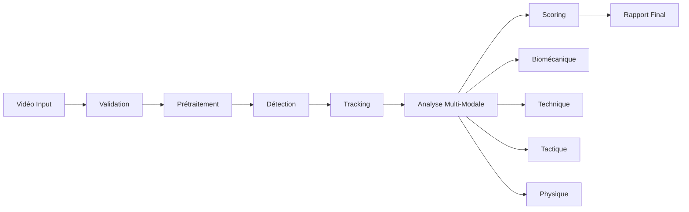

# 🔄 Pipeline de Traitement - FootballAI Analyzer

## 📊 Vue d'ensemble du Pipeline

Le pipeline de traitement transforme une vidéo brute en analyse complète avec notation et feedback. Chaque étape est optimisée pour la performance et la précision.



## 🎬 Étape 1 : Réception et Validation

### Objectif
Valider la vidéo d'entrée et préparer le traitement.

### Processus détaillé

```python
def validate_video(video_path: str) -> ValidationResult:
    """
    1. Vérifier le format (MP4, AVI, MOV, MKV)
    2. Contrôler la taille (<2GB par défaut)
    3. Vérifier la durée (1 sec - 2 heures)
    4. Analyser la qualité (résolution, FPS)
    5. Détecter la corruption
    """
    
    # Exemple de validation
    video = VideoCapture(video_path)
    
    # Métadonnées extraites
    metadata = {
        "duration": video.duration,
        "fps": video.fps,
        "resolution": (video.width, video.height),
        "codec": video.codec,
        "size_mb": video.size / 1024 / 1024
    }
    
    # Critères de validation
    if metadata["resolution"][1] < 480:
        return ValidationResult(False, "Résolution trop faible")
    
    if metadata["fps"] < 20:
        return ValidationResult(False, "FPS insuffisant")
        
    return ValidationResult(True, metadata)
```

### Sorties
- Métadonnées vidéo
- Statut de validation
- Recommendations de traitement

## 🔧 Étape 2 : Prétraitement Vidéo

### Objectif
Optimiser la vidéo pour l'analyse IA.

### Processus détaillé

```python
def preprocess_video(video: Video, config: ProcessingConfig) -> ProcessedVideo:
    """
    Pipeline de prétraitement complet
    """
    
    # 1. Stabilisation vidéo (si nécessaire)
    if video.is_shaky():
        video = stabilize_video(video)
    
    # 2. Ajustement de la qualité
    if video.resolution > (1920, 1080):
        video = resize_video(video, target_resolution=(1920, 1080))
    
    # 3. Normalisation des FPS (Mode précision maximale)
    if video.fps != 60:
        video = interpolate_fps(video, target_fps=60)
    
    # 4. Amélioration de la luminosité/contraste
    video = enhance_quality(video, 
                          brightness_factor=1.1,
                          contrast_factor=1.2)
    
    # 5. Détection et extraction des scènes pertinentes
    scenes = detect_scenes(video, threshold=0.3)
    
    # 6. Extraction des frames clés
    frames = extract_frames(video, 
                          method="all_frames",  # Précision maximale
                          interval=1/60)  # 60 FPS
    
    return ProcessedVideo(video, frames, scenes)
```

### Optimisations
- **Cache intelligent** : Réutiliser frames déjà extraites
- **Traitement parallèle** : Multi-threading pour extraction
- **Compression adaptative** : Réduire taille sans perte qualité

## 🎯 Étape 3 : Détection d'Objets

### Objectif
Identifier tous les éléments pertinents dans chaque frame.

### Processus détaillé

```python
def detect_objects(frames: List[Frame]) -> DetectionResults:
    """
    Détection haute précision avec modèles SOTA
    """
    
    # Chargement du modèle (au choix selon benchmarks)
    # Option 1: YOLOv10 (plus rapide, NMS-free)
    model = YOLOv10('yolov10x-football.pt')
    
    # Option 2: RT-DETR (meilleure précision)
    model = RTDETR('rtdetr-x-football.pt')
    
    # Option 3: DINO-DETR (state-of-the-art)
    model = DINODETR('dino-detr-football.pt')
    
    model.to('cuda')  # GPU obligatoire pour 60 FPS
    
    detections = []
    
    # Traitement par batch pour efficacité
    for batch in batch_frames(frames, batch_size=32):
        
        # Inférence parallèle
        results = model(batch, 
                       conf=0.5,
                       iou=0.45,
                       classes=['person', 'ball', 'goal'])
        
        # Post-traitement
        for frame_idx, result in enumerate(results):
            frame_detections = {
                'players': [],
                'ball': None,
                'goals': [],
                'referees': []
            }
            
            # Classification des personnes
            for det in result.boxes:
                if det.cls == 'person':
                    person_type = classify_person(det, frame)
                    if person_type == 'player':
                        frame_detections['players'].append(det)
                    elif person_type == 'referee':
                        frame_detections['referees'].append(det)
                        
                elif det.cls == 'ball':
                    frame_detections['ball'] = det
                    
            detections.append(frame_detections)
    
    return DetectionResults(detections)
```

### Techniques avancées
- **NMS (Non-Maximum Suppression)** : Éliminer doublons
- **Confidence thresholding** : Filtrer détections incertaines
- **ROI focusing** : Concentrer sur zones d'intérêt

## 🏃 Étape 4 : Tracking Multi-Objets

### Objectif
Suivre chaque objet à travers les frames avec ID persistant.

### Processus détaillé

```python
def track_objects(detections: DetectionResults) -> TrackingResults:
    """
    Tracking robuste avec ByteTrack
    """
    
    # Initialisation du tracker
    tracker = ByteTracker(
        track_thresh=0.6,
        match_thresh=0.8,
        track_buffer=30
    )
    
    # Tracking des joueurs
    player_tracks = []
    ball_track = []
    
    for frame_idx, frame_detections in enumerate(detections):
        
        # Update tracker avec nouvelles détections
        tracked_objects = tracker.update(frame_detections['players'])
        
        # Gestion des occlusions
        for track in tracked_objects:
            if track.is_occluded():
                # Prédiction Kalman pour position
                track.predict_position()
            
            # Association équipe par couleur maillot
            if not track.team_assigned:
                track.team = classify_team(track, frame)
        
        # Tracking spécial pour le ballon
        if frame_detections['ball']:
            ball_track.append({
                'frame': frame_idx,
                'position': frame_detections['ball'].xyxy,
                'possession': estimate_possession(
                    frame_detections['ball'],
                    tracked_objects
                )
            })
        
        player_tracks.append(tracked_objects)
    
    return TrackingResults(player_tracks, ball_track)
```

### Gestion des cas difficiles
- **Occlusions** : Interpolation et prédiction
- **Sorties/entrées de champ** : Gestion des IDs
- **Croisements** : Disambiguation par features

## 🦴 Étape 5 : Analyse Biomécanique

### Objectif
Extraire et analyser la posture et les mouvements corporels.

### Processus détaillé

```python
def analyze_biomechanics(tracks: TrackingResults) -> BiomechanicsResults:
    """
    Analyse posturale avec MediaPipe
    """
    
    # Initialisation MediaPipe
    pose = mp.solutions.pose.Pose(
        static_image_mode=False,
        model_complexity=2,
        enable_segmentation=True,
        min_detection_confidence=0.5
    )
    
    biomechanics_data = []
    
    for player_track in tracks.player_tracks:
        player_analysis = {
            'id': player_track.id,
            'poses': [],
            'angles': [],
            'balance_scores': [],
            'movement_quality': []
        }
        
        # Extraction pose pour chaque frame
        for frame in player_track.frames:
            # Crop autour du joueur
            player_img = crop_player(frame, player_track.bbox)
            
            # Extraction keypoints
            results = pose.process(player_img)
            
            if results.pose_landmarks:
                # Calcul des angles articulaires
                angles = calculate_joint_angles(results.pose_landmarks)
                
                # Analyse de l'équilibre
                balance = analyze_balance(results.pose_landmarks)
                
                # Qualité du mouvement
                quality = assess_movement_quality(
                    results.pose_landmarks,
                    previous_poses=player_analysis['poses'][-5:]
                )
                
                player_analysis['poses'].append(results.pose_landmarks)
                player_analysis['angles'].append(angles)
                player_analysis['balance_scores'].append(balance)
                player_analysis['movement_quality'].append(quality)
        
        # Métriques agrégées
        player_analysis['avg_balance'] = np.mean(player_analysis['balance_scores'])
        player_analysis['symmetry_score'] = calculate_symmetry(player_analysis['poses'])
        
        biomechanics_data.append(player_analysis)
    
    return BiomechanicsResults(biomechanics_data)
```

### Métriques clés
- **Angles articulaires** : Genoux, hanches, épaules
- **Centre de masse** : Stabilité et équilibre
- **Symétrie corporelle** : Détection déséquilibres
- **Fluidité** : Smoothness des mouvements

## ⚽ Étape 6 : Analyse Technique

### Objectif
Classifier et évaluer les gestes techniques football.

### Processus détaillé

```python
def analyze_technical_skills(
    tracks: TrackingResults,
    biomechanics: BiomechanicsResults
) -> TechnicalResults:
    """
    Analyse des gestes techniques
    """
    
    # Modèle de classification d'actions
    action_model = load_action_classifier('timesformer_football.pth')
    
    technical_events = []
    
    # Détection des contacts avec le ballon
    ball_contacts = detect_ball_contacts(tracks)
    
    for contact in ball_contacts:
        # Extraction fenêtre temporelle
        action_window = extract_action_window(
            tracks,
            contact,
            before_frames=30,
            after_frames=30
        )
        
        # Classification de l'action
        action_type = action_model.classify(action_window)
        # Ex: 'pass', 'shot', 'dribble', 'control'
        
        # Analyse spécifique selon le type
        if action_type == 'pass':
            analysis = analyze_pass(
                action_window,
                biomechanics.get_player_data(contact.player_id)
            )
            
            # Évaluation technique
            technique_score = evaluate_pass_technique(analysis)
            
        elif action_type == 'shot':
            analysis = analyze_shot(
                action_window,
                biomechanics.get_player_data(contact.player_id)
            )
            
            technique_score = evaluate_shot_technique(analysis)
            
        # Création de l'événement technique
        event = TechnicalEvent(
            type=action_type,
            player_id=contact.player_id,
            timestamp=contact.frame_time,
            analysis=analysis,
            score=technique_score,
            feedback=generate_technical_feedback(analysis, technique_score)
        )
        
        technical_events.append(event)
    
    return TechnicalResults(technical_events)
```

### Critères d'évaluation
- **Timing** : Moment du contact
- **Précision** : Direction et force
- **Posture** : Position du corps
- **Suivi** : Mouvement après contact

## 📊 Étape 7 : Analyse Tactique

### Objectif
Évaluer les aspects collectifs et décisionnels.

### Processus détaillé

```python
def analyze_tactics(
    tracks: TrackingResults,
    technical: TechnicalResults
) -> TacticalResults:
    """
    Analyse tactique avancée
    """
    
    tactical_data = {
        'formations': [],
        'transitions': [],
        'pressing_events': [],
        'space_creation': [],
        'decision_quality': []
    }
    
    # Analyse par séquence de jeu
    for sequence in extract_play_sequences(tracks):
        
        # 1. Détection de formation
        for team in ['home', 'away']:
            formation = detect_formation(
                get_team_players(tracks, team, sequence.start_frame)
            )
            tactical_data['formations'].append({
                'team': team,
                'formation': formation,
                'timestamp': sequence.start_time
            })
        
        # 2. Analyse des transitions
        if is_transition(sequence):
            transition = analyze_transition(sequence, tracks)
            tactical_data['transitions'].append(transition)
        
        # 3. Détection du pressing
        pressing = detect_pressing_patterns(sequence, tracks)
        if pressing:
            tactical_data['pressing_events'].extend(pressing)
        
        # 4. Création d'espaces
        space_events = analyze_space_creation(sequence, tracks)
        tactical_data['space_creation'].extend(space_events)
    
    # 5. Qualité des décisions
    for tech_event in technical.events:
        context = build_game_context(tech_event, tracks)
        
        decision_score = evaluate_decision(
            tech_event,
            context,
            alternative_options=find_alternatives(context)
        )
        
        tactical_data['decision_quality'].append({
            'event': tech_event,
            'score': decision_score,
            'better_options': find_better_options(context)
        })
    
    return TacticalResults(tactical_data)
```

### Métriques tactiques
- **Compacité** : Distance entre joueurs
- **Largeur/Profondeur** : Occupation terrain
- **Synchronisation** : Mouvements coordonnés
- **Transitions** : Vitesse de réorganisation

## 🏃‍♂️ Étape 8 : Analyse Physique

### Objectif
Mesurer les efforts et capacités physiques.

### Processus détaillé

```python
def analyze_physical_performance(
    tracks: TrackingResults,
    biomechanics: BiomechanicsResults
) -> PhysicalResults:
    """
    Analyse des performances physiques
    """
    
    physical_data = {}
    
    for player_track in tracks.player_tracks:
        player_physical = {
            'id': player_track.id,
            'total_distance': 0,
            'sprints': [],
            'max_speed': 0,
            'accelerations': [],
            'decelerations': [],
            'jumps': [],
            'work_rate': []
        }
        
        # Calcul des distances et vitesses
        positions = player_track.get_positions()
        for i in range(1, len(positions)):
            # Distance parcourue
            distance = calculate_distance(positions[i-1], positions[i])
            player_physical['total_distance'] += distance
            
            # Vitesse instantanée
            speed = distance / (1/tracks.fps)  # m/s
            
            if speed > player_physical['max_speed']:
                player_physical['max_speed'] = speed
            
            # Détection des sprints (>7 m/s)
            if speed > 7.0:
                if not player_physical['sprints'] or \
                   i - player_physical['sprints'][-1]['end_frame'] > 30:
                    player_physical['sprints'].append({
                        'start_frame': i,
                        'end_frame': i,
                        'max_speed': speed
                    })
                else:
                    player_physical['sprints'][-1]['end_frame'] = i
                    player_physical['sprints'][-1]['max_speed'] = max(
                        player_physical['sprints'][-1]['max_speed'],
                        speed
                    )
        
        # Analyse des sauts
        for i, pose in enumerate(biomechanics.get_player_poses(player_track.id)):
            if is_jumping(pose, previous_poses=biomechanics.get_previous_poses(player_track.id, i, 10)):
                jump_height = estimate_jump_height(pose, tracks.fps)
                player_physical['jumps'].append({
                    'frame': i,
                    'height': jump_height,
                    'type': classify_jump_type(pose)
                })
        
        # Calcul du work rate (intensité)
        player_physical['work_rate'] = calculate_work_rate(
            player_physical['total_distance'],
            len(positions) / tracks.fps,  # durée en secondes
            player_physical['sprints']
        )
        
        physical_data[player_track.id] = player_physical
    
    return PhysicalResults(physical_data)
```

### Métriques physiques
- **Distance totale** : En mètres
- **Vitesse max** : En km/h
- **Nombre de sprints** : >25 km/h
- **Accélérations** : >3 m/s²
- **Charge de travail** : Intensité globale

## 🎯 Étape 9 : Scoring et Agrégation

### Objectif
Combiner toutes les analyses en scores finaux.

### Processus détaillé

```python
def calculate_final_scores(
    biomechanics: BiomechanicsResults,
    technical: TechnicalResults,
    tactical: TacticalResults,
    physical: PhysicalResults
) -> FinalScores:
    """
    Agrégation multi-critères des scores
    """
    
    scores = {}
    
    for player_id in get_all_player_ids():
        # Collecte des scores par domaine
        bio_score = biomechanics.get_player_score(player_id)
        tech_score = technical.get_player_score(player_id)
        tact_score = tactical.get_player_score(player_id)
        phys_score = physical.get_player_score(player_id)
        
        # Pondération selon le contexte
        if is_training_video():
            weights = {
                'biomechanics': 0.35,
                'technical': 0.45,
                'tactical': 0.10,
                'physical': 0.10
            }
        else:  # Match
            weights = {
                'biomechanics': 0.15,
                'technical': 0.30,
                'tactical': 0.35,
                'physical': 0.20
            }
        
        # Score global pondéré
        global_score = (
            bio_score * weights['biomechanics'] +
            tech_score * weights['technical'] +
            tact_score * weights['tactical'] +
            phys_score * weights['physical']
        )
        
        # Création du profil de performance
        performance_profile = {
            'player_id': player_id,
            'global_score': global_score,
            'biomechanics_score': bio_score,
            'technical_score': tech_score,
            'tactical_score': tact_score,
            'physical_score': phys_score,
            'strengths': identify_strengths(bio_score, tech_score, tact_score, phys_score),
            'weaknesses': identify_weaknesses(bio_score, tech_score, tact_score, phys_score),
            'progression_areas': suggest_improvements(bio_score, tech_score, tact_score, phys_score)
        }
        
        scores[player_id] = performance_profile
    
    return FinalScores(scores)
```

### Système de notation
- **0-100** : Échelle standardisée
- **Pondération contextuelle** : Selon type vidéo
- **Normalisation** : Comparaison équitable
- **Intervalles de confiance** : Fiabilité des scores

## 📄 Étape 10 : Génération du Rapport

### Objectif
Créer un rapport complet et actionnable.

### Processus détaillé

```python
def generate_report(
    video_metadata: dict,
    final_scores: FinalScores,
    all_analyses: dict
) -> Report:
    """
    Génération du rapport final
    """
    
    report = Report()
    
    # 1. Page de couverture
    report.add_cover_page(
        title="Analyse Performance Football",
        date=datetime.now(),
        video_info=video_metadata
    )
    
    # 2. Résumé exécutif
    report.add_executive_summary(
        key_findings=extract_key_findings(all_analyses),
        overall_performance=summarize_performance(final_scores),
        main_recommendations=get_top_recommendations(all_analyses)
    )
    
    # 3. Analyse détaillée par joueur
    for player_id, player_scores in final_scores.items():
        player_section = report.create_player_section(player_id)
        
        # Scores visuels
        player_section.add_radar_chart(
            categories=['Technique', 'Tactique', 'Physique', 'Biomécanique'],
            values=[
                player_scores['technical_score'],
                player_scores['tactical_score'],
                player_scores['physical_score'],
                player_scores['biomechanics_score']
            ]
        )
        
        # Analyse technique
        player_section.add_technical_analysis(
            events=all_analyses['technical'].get_player_events(player_id),
            include_screenshots=True
        )
        
        # Recommandations personnalisées
        player_section.add_recommendations(
            generate_personalized_recommendations(
                player_scores,
                all_analyses,
                player_id
            )
        )
    
    # 4. Analyse collective (si applicable)
    if is_team_video():
        team_section = report.create_team_section()
        team_section.add_formation_analysis(all_analyses['tactical']['formations'])
        team_section.add_transition_analysis(all_analyses['tactical']['transitions'])
        team_section.add_collective_metrics(calculate_team_metrics(all_analyses))
    
    # 5. Plan de progression
    report.add_improvement_plan(
        short_term=generate_short_term_plan(all_analyses),
        medium_term=generate_medium_term_plan(all_analyses),
        exercises=suggest_training_exercises(all_analyses)
    )
    
    # 6. Annexes techniques
    report.add_appendix(
        glossary=technical_glossary(),
        methodology=analysis_methodology(),
        detailed_data=export_raw_data(all_analyses)
    )
    
    # Génération des formats de sortie
    pdf_report = report.to_pdf()
    web_report = report.to_html()
    video_annotated = create_annotated_video(video, all_analyses)
    
    return {
        'pdf': pdf_report,
        'web': web_report,
        'video': video_annotated
    }
```

### Éléments du rapport
- **Résumé exécutif** : Points clés en 1 page
- **Analyses détaillées** : Par joueur et critère
- **Visualisations** : Graphiques et statistiques
- **Recommandations** : Concrètes et actionnables
- **Plan de progression** : Court/moyen terme

## 🚀 Optimisations du Pipeline

### Parallélisation
```python
# Traitement parallèle des modules indépendants
with concurrent.futures.ThreadPoolExecutor() as executor:
    bio_future = executor.submit(analyze_biomechanics, tracks)
    tech_future = executor.submit(analyze_technical_skills, tracks)
    phys_future = executor.submit(analyze_physical_performance, tracks)
    
    biomechanics = bio_future.result()
    technical = tech_future.result()
    physical = phys_future.result()
```

### Mise en cache
```python
# Cache des résultats intermédiaires
@lru_cache(maxsize=1000)
def cached_pose_extraction(player_image_hash):
    return extract_pose(player_image)
```

### Mode dégradé
```python
# Adaptation selon les ressources
if not gpu_available():
    config.batch_size = 8  # Réduit de 32
    config.model_precision = 'fp16'  # Demi-précision
    config.skip_3d_pose = True  # Désactive 3D
```

## 📊 Métriques de Performance (Mode Précision Maximale 60 FPS)

| Étape | Temps (GPU RTX 3060+) | Temps (GPU RTX 4070+) | Précision |
|-------|----------------------|----------------------|-----------|
| Validation | <1s | <1s | 100% |
| Prétraitement 60 FPS | 45s/min | 30s/min | - |
| Détection SOTA | 30s/min | 20s/min | 95%+ mAP |
| Tracking avancé | 20s/min | 15s/min | 92%+ MOTA |
| Biomécanique HD | 30s/min | 20s/min | 97%+ PCK |
| Technique précise | 25s/min | 18s/min | 94%+ Acc |
| Tactique complète | 15s/min | 12s/min | 91%+ F1 |
| Physique 60 FPS | 10s/min | 8s/min | 99%+ Acc |
| Scoring | 5s | 5s | - |
| Rapport | 30s | 30s | - |

**Total estimé** : 
- GPU RTX 3060+ : ~8-10 min pour 10 min de vidéo
- GPU RTX 4070+ : ~6-7 min pour 10 min de vidéo
- Mode CPU : Non recommandé (>30 min et précision dégradée) 