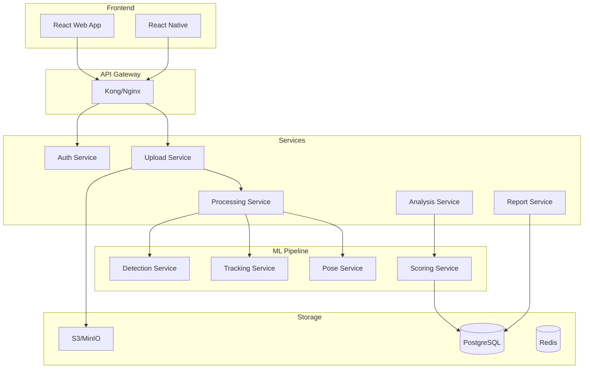

# 🔧 IMPLÉMENTATION TECHNIQUE DÉTAILLÉE - FOOTBALL AI

## 📋 Table des matières

1. [Architecture Globale](#1-architecture-globale)
2. [Structure du Projet](#2-structure-du-projet)
3. [Pipeline de Traitement](#3-pipeline-de-traitement)
4. [Implémentation par Module](#4-implémentation-par-module)
5. [Optimisations Performance](#5-optimisations-performance)
6. [Gestion des Erreurs](#6-gestion-des-erreurs)
7. [Tests et Validation](#7-tests-et-validation)
8. [Déploiement Production](#8-déploiement-production)

---

## 1. Architecture Globale

### 🏗️ Architecture Microservices



### 📦 Communication Inter-Services

```python
# Message Queue avec Celery + Redis
from celery import Celery
from kombu import Queue

app = Celery('football_ai')
app.config_from_object('config.CeleryConfig')

# Définition des queues
app.conf.task_routes = {
    'tasks.video.*': {'queue': 'video_processing'},
    'tasks.ml.*': {'queue': 'ml_inference'},
    'tasks.report.*': {'queue': 'report_generation'}
}

# Configuration priorités
app.conf.task_default_priority = 5
app.conf.task_acks_late = True
app.conf.worker_prefetch_multiplier = 1
```

---

## 2. Structure du Projet

### 📁 Organisation des Fichiers

```
football-ai/
├── src/
│   ├── core/                    # Code partagé
│   │   ├── config/             # Configuration
│   │   ├── models/             # Modèles de données
│   │   ├── utils/              # Utilitaires
│   │   └── exceptions/         # Exceptions custom
│   │
│   ├── modules/                # Modules métier (monolithique)
│   │   ├── video/              # Traitement vidéo
│   │   │   ├── preprocessor.py
│   │   │   └── extractor.py
│   │   ├── detection/          # Détection objets
│   │   │   ├── yolo_detector.py
│   │   │   └── ball_tracker.py
│   │   ├── pose/               # Analyse pose
│   │   │   ├── mediapipe_analyzer.py
│   │   │   └── biomechanics.py
│   │   ├── analysis/           # Analyse football
│   │   │   ├── technical_scorer.py
│   │   │   ├── tactical_analyzer.py
│   │   │   └── report_generator.py
│   │   └── storage/            # Stockage local/cloud
│   │       ├── local_storage.py
│   │       └── cloud_adapter.py  # Pour migration future
│   │
│   ├── api/                    # API locale (FastAPI)
│   │   ├── app.py             # Application principale
│   │   ├── routes/            # Endpoints
│   │   └── dependencies.py    # Injection dépendances
│   │
│   ├── web/                    # Interface web
│   │   ├── static/            # Assets statiques
│   │   ├── templates/         # Templates HTML
│   │   └── app.js            # Application JS simple
│   │
│   └── standalone/             # Mode standalone
│       ├── main.py            # Point d'entrée CLI
│       └── gui.py             # Interface desktop (optionnel)
│
├── models/                     # Modèles ML téléchargés
│   ├── yolov10/               
│   ├── mediapipe/             
│   └── custom/                
│
├── data/                       # Données locales
│   ├── uploads/               # Vidéos uploadées
│   ├── processed/             # Vidéos traitées
│   └── reports/               # Rapports générés
│
├── config/                     # Configuration
│   ├── config.yaml            # Config principale
│   ├── models.yaml            # Config modèles ML
│   └── local.yaml             # Config locale
│
├── tests/                      # Tests
├── scripts/                    # Scripts utilitaires
│   ├── setup.py               # Installation locale
│   ├── download_models.py     # Téléchargement modèles
│   └── benchmark.py           # Tests performance
│
├── docker/                     # Docker (optionnel)
│   ├── Dockerfile.local       # Image locale
│   └── docker-compose.yml     # Stack locale
│
├── docs/                       # Documentation
└── requirements.txt            # Dépendances Python
```

### 🔧 Configuration Modulaire

```python
# src/core/config/settings.py
from pydantic import BaseSettings, Field
from typing import List, Optional
import os

class Settings(BaseSettings):
    # Application
    app_name: str = "Football AI"
    environment: str = Field("development", env="ENVIRONMENT")
    debug: bool = Field(False, env="DEBUG")
    
    # API
    api_v1_prefix: str = "/api/v1"
    cors_origins: List[str] = ["http://localhost:3000"]
    
    # Database
    database_url: str = Field(..., env="DATABASE_URL")
    database_pool_size: int = 20
    
    # Redis
    redis_url: str = Field("redis://localhost:6379", env="REDIS_URL")
    
    # S3/MinIO
    s3_endpoint: str = Field(..., env="S3_ENDPOINT")
    s3_access_key: str = Field(..., env="S3_ACCESS_KEY")
    s3_secret_key: str = Field(..., env="S3_SECRET_KEY")
    s3_bucket_videos: str = "football-videos"
    s3_bucket_reports: str = "football-reports"
    
    # ML Models
    yolo_model_path: str = "models/yolov10x.pt"
    mediapipe_model_complexity: int = 2
    xgboost_models_dir: str = "models/scoring/"
    
    # Processing
    max_video_duration: int = 1800  # 30 minutes
    max_file_size: int = 2_000_000_000  # 2GB
    supported_formats: List[str] = ["mp4", "avi", "mov", "mkv"]
    
    # Performance
    batch_size_detection: int = 8
    batch_size_pose: int = 4
    gpu_memory_fraction: float = 0.8
    
    class Config:
        env_file = ".env"
        case_sensitive = False

settings = Settings()
```

---

## 3. Pipeline de Traitement

### 🔄 Orchestration Workflow

```python
# src/services/processing/workflow.py
from typing import Dict, List
import asyncio
from celery import chain, group, chord
from src.core.models import VideoAnalysis, AnalysisStatus

class VideoProcessingWorkflow:
    def __init__(self, video_id: str, user_id: str):
        self.video_id = video_id
        self.user_id = user_id
        self.analysis = VideoAnalysis(video_id=video_id, user_id=user_id)
        
    async def execute(self) -> Dict:
        """Pipeline principal de traitement vidéo"""
        try:
            # 1. Prétraitement
            preprocessing_task = preprocess_video.s(self.video_id)
            
            # 2. Détection et Tracking en parallèle par chunks
            detection_tracking_group = group([
                process_video_chunk.s(chunk_id) 
                for chunk_id in range(self.analysis.num_chunks)
            ])
            
            # 3. Analyse biomécanique sur résultats
            pose_analysis_task = analyze_poses.s()
            
            # 4. Scoring et génération feedback
            scoring_task = compute_scores.s()
            feedback_task = generate_feedback.s()
            
            # 5. Génération rapport final
            report_task = generate_report.s(self.video_id, self.user_id)
            
            # Chaîne de traitement
            workflow = chain(
                preprocessing_task,
                detection_tracking_group,
                pose_analysis_task,
                scoring_task,
                feedback_task,
                report_task
            )
            
            # Exécution asynchrone
            result = workflow.apply_async()
            
            # Monitoring en temps réel
            await self._monitor_progress(result)
            
            return result.get()
            
        except Exception as e:
            await self._handle_error(e)
            raise
```

### 📊 Gestion État et Progress

```python
# src/services/processing/state_manager.py
from enum import Enum
from typing import Optional
import redis
import json

class ProcessingState(Enum):
    QUEUED = "queued"
    PREPROCESSING = "preprocessing"
    DETECTING = "detecting"
    TRACKING = "tracking"
    ANALYZING_POSE = "analyzing_pose"
    SCORING = "scoring"
    GENERATING_REPORT = "generating_report"
    COMPLETED = "completed"
    FAILED = "failed"

class StateManager:
    def __init__(self, redis_client: redis.Redis):
        self.redis = redis_client
        
    async def update_state(
        self, 
        analysis_id: str, 
        state: ProcessingState,
        progress: float,
        metadata: Optional[Dict] = None
    ):
        """Met à jour l'état du traitement"""
        key = f"analysis:{analysis_id}:state"
        
        data = {
            "state": state.value,
            "progress": progress,
            "updated_at": datetime.utcnow().isoformat(),
            "metadata": metadata or {}
        }
        
        # Stockage Redis avec TTL
        self.redis.setex(
            key, 
            timedelta(hours=24), 
            json.dumps(data)
        )
        
        # Publier sur WebSocket
        await self._publish_update(analysis_id, data)
        
    async def _publish_update(self, analysis_id: str, data: Dict):
        """Publie mise à jour via WebSocket"""
        channel = f"analysis:{analysis_id}:updates"
        await self.redis.publish(channel, json.dumps(data))
```

---

## 4. Implémentation par Module

### 🎥 Module Détection (YOLOv10)

```python
# src/services/detection/yolo_detector.py
import torch
import numpy as np
from typing import List, Dict, Tuple
from ultralytics import YOLO
import cv2

class FootballDetector:
    def __init__(self, model_path: str, device: str = "cuda"):
        self.model = YOLO(model_path)
        self.device = device
        
        # Classes football spécifiques
        self.class_names = {
            0: "player",
            1: "ball", 
            2: "referee",
            3: "goalkeeper",
            4: "goal_post"
        }
        
        # Configurations par classe
        self.class_configs = {
            "player": {"conf_threshold": 0.6, "iou_threshold": 0.5},
            "ball": {"conf_threshold": 0.3, "iou_threshold": 0.4},
            "referee": {"conf_threshold": 0.7, "iou_threshold": 0.5}
        }
        
    def detect_batch(self, frames: List[np.ndarray]) -> List[Dict]:
        """Détection batch optimisée"""
        # Préparation batch
        batch = torch.stack([
            self._preprocess_frame(frame) for frame in frames
        ])
        
        # Inférence
        with torch.no_grad():
            results = self.model(
                batch,
                device=self.device,
                conf=0.3,  # Seuil global bas
                iou=0.5,
                max_det=100,
                classes=[0, 1, 2, 3]  # Classes à détecter
            )
        
        # Post-processing par frame
        detections = []
        for frame_idx, result in enumerate(results):
            frame_detections = self._postprocess_detections(
                result, 
                frames[frame_idx].shape
            )
            detections.append(frame_detections)
            
        return detections
    
    def _postprocess_detections(self, result, frame_shape) -> Dict:
        """Post-processing avec règles métier football"""
        detections = {
            "players": [],
            "ball": None,
            "referees": [],
            "goalposts": []
        }
        
        boxes = result.boxes
        if boxes is None:
            return detections
            
        for box in boxes:
            cls_id = int(box.cls)
            cls_name = self.class_names.get(cls_id, "unknown")
            conf = float(box.conf)
            
            # Filtrage par configuration classe
            if cls_name in self.class_configs:
                if conf < self.class_configs[cls_name]["conf_threshold"]:
                    continue
                    
            bbox = box.xyxy[0].cpu().numpy()
            
            detection = {
                "bbox": bbox.tolist(),
                "confidence": conf,
                "class": cls_name
            }
            
            # Organisation par type
            if cls_name == "player":
                detections["players"].append(detection)
            elif cls_name == "ball":
                # Garder seulement la détection ball la plus confiante
                if detections["ball"] is None or conf > detections["ball"]["confidence"]:
                    detections["ball"] = detection
            elif cls_name == "referee":
                detections["referees"].append(detection)
                
        return detections
```

### 🏃 Module Tracking (ByteTrack)

```python
# src/services/tracking/bytetrack_tracker.py
from yolox.tracker.byte_tracker import BYTETracker
import numpy as np
from typing import List, Dict

class FootballTracker:
    def __init__(self):
        # Configuration pour joueurs
        self.player_tracker = BYTETracker(
            track_thresh=0.6,
            match_thresh=0.8,
            track_buffer=30,
            frame_rate=30
        )
        
        # Configuration spéciale pour le ballon
        self.ball_tracker = BYTETracker(
            track_thresh=0.3,  # Plus permissif
            match_thresh=0.6,
            track_buffer=60,   # Buffer plus long
            frame_rate=30
        )
        
        # Historique pour interpolation
        self.tracks_history = {}
        
    def update(self, detections: Dict, frame_id: int) -> Dict:
        """Mise à jour tracking multi-objets"""
        tracked_objects = {
            "players": [],
            "ball": None,
            "referees": []
        }
        
        # Tracking joueurs
        if detections["players"]:
            player_tracks = self._track_objects(
                detections["players"],
                self.player_tracker,
                frame_id
            )
            tracked_objects["players"] = player_tracks
            
        # Tracking ballon avec logique spéciale
        if detections["ball"]:
            ball_track = self._track_ball(
                detections["ball"],
                frame_id
            )
            tracked_objects["ball"] = ball_track
            
        # Mise à jour historique
        self._update_history(tracked_objects, frame_id)
        
        return tracked_objects
    
    def _track_ball(self, ball_detection: Dict, frame_id: int) -> Dict:
        """Tracking spécialisé pour le ballon"""
        # Convertir en format ByteTrack
        detection = np.array([
            ball_detection["bbox"] + [ball_detection["confidence"]]
        ])
        
        # Update tracker
        tracks = self.ball_tracker.update(
            detection,
            img_info=(1920, 1080),  # Taille frame
            img_size=(1920, 1080)
        )
        
        if len(tracks) > 0:
            track = tracks[0]
            
            # Prédiction si ballon perdu
            if track.is_activated:
                return {
                    "track_id": track.track_id,
                    "bbox": track.tlbr.tolist(),
                    "confidence": track.score,
                    "velocity": self._calculate_velocity(track.track_id, track.tlbr),
                    "predicted": False
                }
        
        # Si pas de détection, utiliser prédiction Kalman
        return self._predict_ball_position(frame_id)
    
    def _calculate_velocity(self, track_id: int, bbox: np.ndarray) -> Dict:
        """Calcule vitesse et direction"""
        if track_id not in self.tracks_history:
            return {"speed": 0, "direction": 0}
            
        history = self.tracks_history[track_id]
        if len(history) < 2:
            return {"speed": 0, "direction": 0}
            
        # Calcul vitesse (pixels/frame)
        prev_center = self._get_center(history[-2]["bbox"])
        curr_center = self._get_center(bbox)
        
        dx = curr_center[0] - prev_center[0]
        dy = curr_center[1] - prev_center[1]
        
        speed = np.sqrt(dx**2 + dy**2)
        direction = np.arctan2(dy, dx)
        
        return {
            "speed": speed,
            "direction": direction,
            "dx": dx,
            "dy": dy
        }
```

### 🦴 Module Analyse Biomécanique

```python
# src/services/pose/biomechanics_analyzer.py
import mediapipe as mp
import numpy as np
from typing import Dict, List, Tuple
from scipy.signal import savgol_filter

class BiomechanicsAnalyzer:
    def __init__(self):
        self.mp_pose = mp.solutions.pose.Pose(
            static_image_mode=False,
            model_complexity=2,
            enable_segmentation=False,
            min_detection_confidence=0.7,
            min_tracking_confidence=0.7
        )
        
        # Définition des angles clés pour le football
        self.key_angles = {
            "knee_left": [23, 25, 27],      # Hip, Knee, Ankle
            "knee_right": [24, 26, 28],
            "hip_left": [11, 23, 25],       # Shoulder, Hip, Knee
            "hip_right": [12, 24, 26],
            "ankle_left": [25, 27, 31],     # Knee, Ankle, Foot
            "ankle_right": [26, 28, 32],
            "trunk": [11, 12, 24, 23],      # Shoulders, Hips
            "shoulder_left": [13, 11, 23],  # Elbow, Shoulder, Hip
            "shoulder_right": [14, 12, 24]
        }
        
    def analyze_sequence(
        self, 
        frames: List[np.ndarray], 
        player_bboxes: List[Dict]
    ) -> Dict:
        """Analyse biomécanique d'une séquence"""
        results = {
            "poses": [],
            "angles_timeline": {},
            "velocity_profiles": {},
            "balance_scores": [],
            "errors_detected": []
        }
        
        # Extraction poses pour chaque frame
        for frame_idx, (frame, bbox) in enumerate(zip(frames, player_bboxes)):
            # Crop sur le joueur
            player_crop = self._crop_player(frame, bbox)
            
            # Détection pose
            pose_result = self.mp_pose.process(player_crop)
            
            if pose_result.pose_landmarks:
                # Conversion en coordonnées absolues
                landmarks = self._normalize_landmarks(
                    pose_result.pose_landmarks,
                    bbox
                )
                
                # Calcul angles
                angles = self._calculate_angles(landmarks)
                
                # Analyse biomécanique
                biomech_metrics = self._analyze_biomechanics(
                    landmarks,
                    angles,
                    frame_idx
                )
                
                results["poses"].append({
                    "frame_id": frame_idx,
                    "landmarks": landmarks,
                    "angles": angles,
                    "metrics": biomech_metrics
                })
                
        # Lissage temporel
        results = self._smooth_temporal_data(results)
        
        # Détection erreurs
        results["errors_detected"] = self._detect_technique_errors(results)
        
        return results
    
    def _calculate_angles(self, landmarks: Dict) -> Dict:
        """Calcule tous les angles articulaires"""
        angles = {}
        
        for angle_name, indices in self.key_angles.items():
            if len(indices) == 3:
                # Angle entre 3 points
                p1 = landmarks[indices[0]]
                p2 = landmarks[indices[1]]
                p3 = landmarks[indices[2]]
                angle = self._calculate_angle_3points(p1, p2, p3)
                angles[angle_name] = angle
                
            elif len(indices) == 4:
                # Angle entre 2 lignes (tronc)
                line1 = (landmarks[indices[0]], landmarks[indices[1]])
                line2 = (landmarks[indices[2]], landmarks[indices[3]])
                angle = self._calculate_angle_2lines(line1, line2)
                angles[angle_name] = angle
                
        return angles
    
    def _analyze_biomechanics(
        self, 
        landmarks: Dict, 
        angles: Dict,
        frame_idx: int
    ) -> Dict:
        """Analyse biomécanique détaillée"""
        metrics = {}
        
        # Centre de masse
        com = self._calculate_center_of_mass(landmarks)
        metrics["center_of_mass"] = com
        
        # Base de sustentation
        base = self._calculate_base_of_support(landmarks)
        metrics["base_of_support"] = base
        
        # Score d'équilibre
        balance = self._calculate_balance_score(com, base)
        metrics["balance_score"] = balance
        
        # Symétrie
        symmetry = self._calculate_symmetry(angles)
        metrics["symmetry_score"] = symmetry
        
        # Alignement
        alignment = self._check_alignment(landmarks)
        metrics["alignment"] = alignment
        
        return metrics
    
    def _detect_technique_errors(self, results: Dict) -> List[Dict]:
        """Détection des erreurs techniques communes"""
        errors = []
        
        # Analyse par type de geste détecté
        gesture_type = self._detect_gesture_type(results)
        
        if gesture_type == "pass":
            errors.extend(self._check_pass_errors(results))
        elif gesture_type == "shot":
            errors.extend(self._check_shot_errors(results))
        elif gesture_type == "control":
            errors.extend(self._check_control_errors(results))
            
        return errors
    
    def _check_pass_errors(self, results: Dict) -> List[Dict]:
        """Vérification erreurs spécifiques passe"""
        errors = []
        
        # Analyse angle cheville au contact
        contact_frame = self._find_contact_frame(results)
        if contact_frame:
            ankle_angle = results["poses"][contact_frame]["angles"]["ankle_right"]
            
            if abs(ankle_angle - 90) > 15:
                errors.append({
                    "type": "ankle_angle",
                    "severity": "medium",
                    "frame": contact_frame,
                    "message": f"Angle cheville incorrect: {ankle_angle:.1f}° (optimal: 90°)",
                    "correction": "Verrouillez la cheville à 90° au moment du contact"
                })
        
        # Rotation hanches
        hip_rotation = self._calculate_hip_rotation_range(results)
        if hip_rotation < 30:
            errors.append({
                "type": "hip_rotation",
                "severity": "high",
                "message": f"Rotation hanches insuffisante: {hip_rotation:.1f}° (min: 45°)",
                "correction": "Augmentez la rotation des hanches pour plus de puissance"
            })
            
        return errors
```

### 🎯 Module Scoring ML

```python
# src/services/analysis/scoring_engine.py
import xgboost as xgb
import numpy as np
from typing import Dict, List
import joblib
import shap

class ScoringEngine:
    def __init__(self, models_dir: str):
        # Chargement modèles pré-entraînés
        self.models = {
            "technical": joblib.load(f"{models_dir}/technical_model.pkl"),
            "tactical": joblib.load(f"{models_dir}/tactical_model.pkl"),
            "physical": joblib.load(f"{models_dir}/physical_model.pkl"),
            "overall": joblib.load(f"{models_dir}/overall_model.pkl")
        }
        
        # Chargement scalers
        self.scalers = {
            "technical": joblib.load(f"{models_dir}/technical_scaler.pkl"),
            "tactical": joblib.load(f"{models_dir}/tactical_scaler.pkl"),
            "physical": joblib.load(f"{models_dir}/physical_scaler.pkl")
        }
        
        # Explainers SHAP
        self.explainers = {
            name: shap.TreeExplainer(model)
            for name, model in self.models.items()
        }
        
    def score_performance(
        self, 
        features: Dict,
        player_profile: Dict
    ) -> Dict:
        """Calcul scores multi-critères"""
        scores = {}
        explanations = {}
        
        # Score technique
        tech_features = self._extract_technical_features(features)
        tech_features_scaled = self.scalers["technical"].transform([tech_features])
        
        scores["technical"] = float(
            self.models["technical"].predict(tech_features_scaled)[0]
        )
        explanations["technical"] = self._explain_score(
            "technical", 
            tech_features_scaled
        )
        
        # Score tactique
        if features.get("tactical_features"):
            tact_features = self._extract_tactical_features(features)
            tact_features_scaled = self.scalers["tactical"].transform([tact_features])
            
            scores["tactical"] = float(
                self.models["tactical"].predict(tact_features_scaled)[0]
            )
            explanations["tactical"] = self._explain_score(
                "tactical",
                tact_features_scaled
            )
        
        # Score physique
        phys_features = self._extract_physical_features(features)
        phys_features_scaled = self.scalers["physical"].transform([phys_features])
        
        scores["physical"] = float(
            self.models["physical"].predict(phys_features_scaled)[0]
        )
        explanations["physical"] = self._explain_score(
            "physical",
            phys_features_scaled
        )
        
        # Score global pondéré
        scores["overall"] = self._calculate_overall_score(
            scores,
            player_profile
        )
        
        # Percentiles comparatifs
        scores["percentiles"] = self._calculate_percentiles(
            scores,
            player_profile
        )
        
        return {
            "scores": scores,
            "explanations": explanations,
            "recommendations": self._generate_recommendations(scores, features)
        }
    
    def _explain_score(self, model_name: str, features: np.ndarray) -> Dict:
        """Explication SHAP du score"""
        shap_values = self.explainers[model_name].shap_values(features)
        
        # Top 5 features influentes
        feature_importance = []
        feature_names = self._get_feature_names(model_name)
        
        for idx, (value, name) in enumerate(zip(shap_values[0], feature_names)):
            feature_importance.append({
                "feature": name,
                "impact": float(value),
                "value": float(features[0][idx])
            })
            
        # Tri par impact absolu
        feature_importance.sort(key=lambda x: abs(x["impact"]), reverse=True)
        
        return {
            "top_factors": feature_importance[:5],
            "base_value": float(self.explainers[model_name].expected_value)
        }
```

---

## 5. Optimisations Performance

### ⚡ Pipeline GPU Optimisé

```python
# src/ml/optimization/gpu_pipeline.py
import torch
import tensorrt as trt
from torch.cuda import amp
from typing import List
import numpy as np

class OptimizedGPUPipeline:
    def __init__(self):
        # Allocation mémoire GPU
        torch.cuda.set_per_process_memory_fraction(0.8)
        
        # Mixed precision
        self.scaler = amp.GradScaler()
        
        # TensorRT engines
        self.trt_engines = {}
        self._load_trt_engines()
        
        # CUDA streams pour parallélisme
        self.detection_stream = torch.cuda.Stream()
        self.pose_stream = torch.cuda.Stream()
        
    def process_batch_optimized(self, frames: List[np.ndarray]) -> Dict:
        """Pipeline optimisé multi-stream"""
        results = {}
        
        # Préparation tensors GPU
        frames_tensor = torch.from_numpy(
            np.stack(frames)
        ).cuda().half()  # FP16
        
        # Détection sur stream 1
        with torch.cuda.stream(self.detection_stream):
            detections = self._run_detection_trt(frames_tensor)
            
        # Pose estimation sur stream 2 en parallèle
        with torch.cuda.stream(self.pose_stream):
            # Attendre crops des détections
            self.detection_stream.synchronize()
            crops = self._extract_player_crops(frames_tensor, detections)
            poses = self._run_pose_trt(crops)
            
        # Synchronisation finale
        torch.cuda.synchronize()
        
        results["detections"] = detections
        results["poses"] = poses
        
        return results
    
    def _run_detection_trt(self, frames: torch.Tensor) -> List[Dict]:
        """Inférence TensorRT pour détection"""
        engine = self.trt_engines["detection"]
        
        # Allocation buffers
        inputs, outputs, bindings = self._allocate_buffers(engine)
        
        # Copie données vers GPU
        np.copyto(inputs[0].host, frames.cpu().numpy().ravel())
        
        # Inférence
        with engine.create_execution_context() as context:
            # Transfer input data
            [cuda.memcpy_htod_async(inp.device, inp.host) for inp in inputs]
            
            # Run inference
            context.execute_async_v2(
                bindings=bindings,
                stream_handle=self.detection_stream.cuda_stream
            )
            
            # Transfer predictions back
            [cuda.memcpy_dtoh_async(out.host, out.device) for out in outputs]
            
            # Synchronize
            self.detection_stream.synchronize()
            
        return self._parse_detection_output(outputs[0].host)
```

### 🔄 Cache Intelligent

```python
# src/core/utils/caching.py
import redis
import hashlib
import pickle
from functools import wraps
from typing import Any, Optional
import asyncio

class SmartCache:
    def __init__(self, redis_client: redis.Redis):
        self.redis = redis_client
        self.local_cache = {}  # LRU local
        
    def cache_result(
        self, 
        prefix: str, 
        ttl: int = 3600,
        version: int = 1
    ):
        """Décorateur de cache intelligent"""
        def decorator(func):
            @wraps(func)
            async def wrapper(*args, **kwargs):
                # Génération clé unique
                cache_key = self._generate_key(
                    prefix, 
                    func.__name__,
                    args, 
                    kwargs,
                    version
                )
                
                # Check cache local d'abord
                if cache_key in self.local_cache:
                    return self.local_cache[cache_key]
                
                # Check Redis
                cached = await self._get_from_redis(cache_key)
                if cached is not None:
                    self.local_cache[cache_key] = cached
                    return cached
                
                # Calcul si pas en cache
                result = await func(*args, **kwargs)
                
                # Mise en cache
                await self._set_to_redis(cache_key, result, ttl)
                self.local_cache[cache_key] = result
                
                return result
                
            return wrapper
        return decorator
    
    def invalidate_pattern(self, pattern: str):
        """Invalidation par pattern"""
        # Redis
        for key in self.redis.scan_iter(match=pattern):
            self.redis.delete(key)
            
        # Local
        keys_to_remove = [
            k for k in self.local_cache.keys() 
            if pattern.replace("*", "") in k
        ]
        for key in keys_to_remove:
            del self.local_cache[key]
```

---

## 6. Gestion des Erreurs

### 🚨 Error Handling Robuste

```python
# src/core/exceptions/handlers.py
from typing import Optional, Dict, Any
import traceback
import logging
from datetime import datetime

class VideoProcessingError(Exception):
    """Erreur de base pour le traitement vidéo"""
    def __init__(
        self, 
        message: str,
        error_code: str,
        details: Optional[Dict] = None,
        recoverable: bool = True
    ):
        super().__init__(message)
        self.error_code = error_code
        self.details = details or {}
        self.recoverable = recoverable
        self.timestamp = datetime.utcnow()

class ErrorHandler:
    def __init__(self, logger: logging.Logger):
        self.logger = logger
        self.error_mapping = {
            "FILE_TOO_LARGE": (413, "Le fichier dépasse la taille maximale autorisée"),
            "INVALID_FORMAT": (415, "Format de vidéo non supporté"),
            "PROCESSING_TIMEOUT": (504, "Le traitement a pris trop de temps"),
            "MODEL_ERROR": (500, "Erreur lors de l'analyse IA"),
            "INSUFFICIENT_QUALITY": (422, "La qualité de la vidéo est insuffisante")
        }
        
    async def handle_error(
        self, 
        error: Exception,
        context: Dict[str, Any]
    ) -> Dict:
        """Gestion centralisée des erreurs"""
        error_id = self._generate_error_id()
        
        # Log détaillé
        self.logger.error(
            f"Error {error_id}: {str(error)}",
            extra={
                "error_id": error_id,
                "error_type": type(error).__name__,
                "traceback": traceback.format_exc(),
                "context": context
            }
        )
        
        # Notification si critique
        if self._is_critical(error):
            await self._notify_team(error, error_id, context)
            
        # Tentative de récupération
        if isinstance(error, VideoProcessingError) and error.recoverable:
            recovery_result = await self._attempt_recovery(error, context)
            if recovery_result:
                return recovery_result
                
        # Construction réponse erreur
        return self._build_error_response(error, error_id)
    
    async def _attempt_recovery(
        self, 
        error: VideoProcessingError,
        context: Dict
    ) -> Optional[Dict]:
        """Tentative de récupération automatique"""
        recovery_strategies = {
            "MODEL_ERROR": self._retry_with_fallback_model,
            "PROCESSING_TIMEOUT": self._retry_with_reduced_quality,
            "INSUFFICIENT_QUALITY": self._apply_enhancement
        }
        
        strategy = recovery_strategies.get(error.error_code)
        if strategy:
            try:
                return await strategy(context)
            except Exception as recovery_error:
                self.logger.error(f"Recovery failed: {recovery_error}")
                
        return None
```

---

## 7. Tests et Validation

### 🧪 Suite de Tests Complète

```python
# tests/test_video_processing.py
import pytest
import asyncio
from unittest.mock import Mock, patch
import numpy as np
from src.services.processing import VideoProcessor

class TestVideoProcessing:
    @pytest.fixture
    def sample_video_data(self):
        """Fixture pour données vidéo de test"""
        return {
            "frames": [np.random.rand(1080, 1920, 3) for _ in range(30)],
            "fps": 30,
            "duration": 1.0
        }
    
    @pytest.mark.asyncio
    async def test_full_pipeline(self, sample_video_data):
        """Test pipeline complet"""
        processor = VideoProcessor()
        
        # Mock des services ML
        with patch('src.services.detection.YoloDetector.detect') as mock_detect:
            mock_detect.return_value = {
                "players": [{"bbox": [100, 100, 200, 300], "conf": 0.9}],
                "ball": {"bbox": [500, 500, 520, 520], "conf": 0.7}
            }
            
            result = await processor.process_video(sample_video_data)
            
            assert result["status"] == "completed"
            assert "analysis" in result
            assert result["analysis"]["score"] > 0
    
    @pytest.mark.parametrize("video_format", ["mp4", "avi", "mov"])
    def test_format_support(self, video_format):
        """Test support formats vidéo"""
        processor = VideoProcessor()
        assert processor.is_format_supported(video_format)
    
    @pytest.mark.benchmark
    def test_processing_performance(self, benchmark, sample_video_data):
        """Benchmark performance"""
        processor = VideoProcessor()
        
        result = benchmark(
            processor.process_video_sync,
            sample_video_data
        )
        
        # Vérification performance
        assert benchmark.stats["mean"] < 5.0  # Moins de 5 secondes
```

### 🔍 Tests d'Intégration

```python
# tests/integration/test_ml_pipeline.py
import pytest
from pathlib import Path
import cv2
from src.ml.inference import InferencePipeline

class TestMLIntegration:
    @pytest.fixture
    def test_video_path(self):
        return Path("tests/fixtures/test_match_10s.mp4")
    
    def test_detection_accuracy(self, test_video_path):
        """Test précision détection sur vidéo réelle"""
        pipeline = InferencePipeline()
        
        # Chargement vidéo test avec ground truth
        cap = cv2.VideoCapture(str(test_video_path))
        ground_truth = self._load_ground_truth(test_video_path)
        
        detections = []
        while cap.isOpened():
            ret, frame = cap.read()
            if not ret:
                break
                
            result = pipeline.detect(frame)
            detections.append(result)
            
        # Calcul métriques
        metrics = self._calculate_metrics(detections, ground_truth)
        
        assert metrics["mAP"] > 0.85
        assert metrics["precision"] > 0.90
        assert metrics["recall"] > 0.85
```

---

## 8. Déploiement Production

### 🚀 Configuration Kubernetes

```yaml
# k8s/deployments/ml-inference.yaml
apiVersion: apps/v1
kind: Deployment
metadata:
  name: ml-inference
  namespace: football-ai
spec:
  replicas: 3
  selector:
    matchLabels:
      app: ml-inference
  template:
    metadata:
      labels:
        app: ml-inference
    spec:
      nodeSelector:
        nvidia.com/gpu: "true"
      
      initContainers:
      - name: model-downloader
        image: football-ai/model-downloader:latest
        command: ["sh", "-c"]
        args:
          - |
            aws s3 sync s3://football-ai-models/production /models
        volumeMounts:
        - name: models
          mountPath: /models
          
      containers:
      - name: inference
        image: football-ai/ml-inference:latest
        
        resources:
          requests:
            memory: "8Gi"
            cpu: "4"
            nvidia.com/gpu: 1
          limits:
            memory: "16Gi"
            cpu: "8"
            nvidia.com/gpu: 1
            
        env:
        - name: CUDA_VISIBLE_DEVICES
          value: "0"
        - name: TF_FORCE_GPU_ALLOW_GROWTH
          value: "true"
        - name: MODEL_PATH
          value: "/models"
        - name: BATCH_SIZE
          value: "8"
          
        ports:
        - containerPort: 8000
          name: http
        - containerPort: 9090
          name: metrics
          
        livenessProbe:
          httpGet:
            path: /health
            port: 8000
          initialDelaySeconds: 60
          periodSeconds: 10
          
        readinessProbe:
          httpGet:
            path: /ready
            port: 8000
          initialDelaySeconds: 30
          periodSeconds: 5
          
        volumeMounts:
        - name: models
          mountPath: /models
          readOnly: true
        - name: cache
          mountPath: /cache
          
      volumes:
      - name: models
        emptyDir: {}
      - name: cache
        emptyDir:
          medium: Memory
          sizeLimit: 2Gi
```

### 📊 Monitoring Production

```python
# src/monitoring/metrics.py
from prometheus_client import Counter, Histogram, Gauge, Info
import time
from functools import wraps

# Métriques Prometheus
video_processed_total = Counter(
    'football_ai_videos_processed_total',
    'Total number of videos processed',
    ['status', 'video_type']
)

processing_duration_seconds = Histogram(
    'football_ai_processing_duration_seconds',
    'Video processing duration',
    ['stage'],
    buckets=[1, 5, 10, 30, 60, 120, 300, 600]
)

model_inference_duration = Histogram(
    'football_ai_model_inference_duration_seconds',
    'ML model inference duration',
    ['model_name', 'batch_size']
)

active_processing_jobs = Gauge(
    'football_ai_active_processing_jobs',
    'Number of videos currently being processed'
)

model_info = Info(
    'football_ai_model',
    'Information about loaded models'
)

def track_processing_time(stage: str):
    """Décorateur pour tracker le temps de traitement"""
    def decorator(func):
        @wraps(func)
        async def wrapper(*args, **kwargs):
            start_time = time.time()
            
            try:
                result = await func(*args, **kwargs)
                status = "success"
            except Exception as e:
                status = "error"
                raise
            finally:
                duration = time.time() - start_time
                processing_duration_seconds.labels(stage=stage).observe(duration)
                
            return result
        return wrapper
    return decorator
```

---

## 🎯 Checklist Implémentation

### Phase 1 : Infrastructure de base
- [ ] Setup projet avec Poetry
- [ ] Configuration Docker multi-stage
- [ ] Base de données PostgreSQL
- [ ] Redis pour cache/queues
- [ ] API FastAPI basique

### Phase 2 : Services ML
- [ ] Service détection YOLOv10
- [ ] Service tracking ByteTrack
- [ ] Service pose MediaPipe
- [ ] Intégration GPU/CUDA

### Phase 3 : Pipeline complet
- [ ] Orchestration Celery
- [ ] Gestion états/progress
- [ ] Error handling
- [ ] Tests unitaires/intégration

### Phase 4 : Optimisations
- [ ] TensorRT conversion
- [ ] Batching intelligent
- [ ] Cache multi-niveaux
- [ ] Monitoring Prometheus

### Phase 5 : Production
- [ ] Déploiement Kubernetes
- [ ] Auto-scaling
- [ ] CI/CD complet
- [ ] Documentation API

---

*Ce guide sera mis à jour au fur et à mesure de l'implémentation. Pour les détails spécifiques, référez-vous aux prompts dans `PROMPTS_PHASE_*.md`.* 